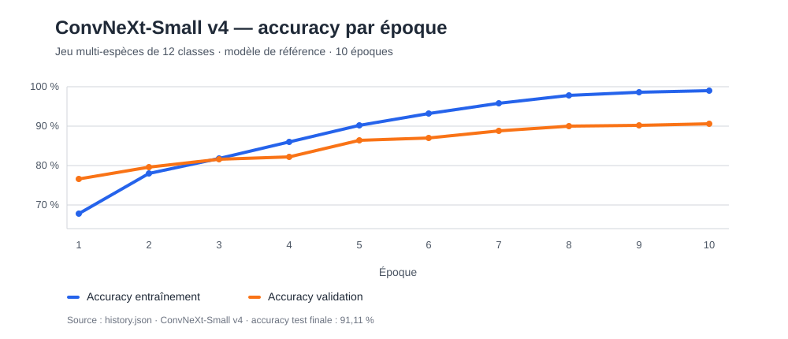

# Détection et identification d'oiseaux à la mangeoire

> **Statut :** pipeline fonctionnel et modèle d'identification entraîné ; validation terrain à poursuivre.

## Contexte

Projet de vision par ordinateur appliqué à l'analyse d'images et de vidéos d'oiseaux observés autour d'une mangeoire.

## Besoin / objectif

Détecter automatiquement la présence d'un animal dans un flux vidéo, puis identifier l'espèce lorsque la qualité de l'image le permet.

## Technologies

- MegaDetector ;
- SpeciesNet ;
- PyTorch ;
- CUDA.
- ConvNeXt-Small ;

## Données

Jeu d'images organisé par classe, complété par des séquences vidéo de mangeoire. Le modèle multi-espèces de référence couvre 12 espèces locales, avec un jeu d'entraînement de 19 061 images et un jeu de test de 4 094 images.

## Démarche

1. préparation et équilibrage du jeu d'images ;
2. entraînement et comparaison de plusieurs versions ConvNeXt-Small sur GPU CUDA ;
3. détection de l'animal avec MegaDetector ;
4. classification de la zone détectée avec le modèle entraîné, avec exploration de SpeciesNet ;
5. export des prédictions et revue des erreurs.

## Compétences mobilisées

- Computer Vision ;
- PyTorch ;
- accélération GPU ;
- traitement d'images ;
- intégration de modèles préentraînés ;
- entraînement et évaluation d'un modèle de classification ;
- analyse d'erreurs.

## Résultats

Six entraînements multi-espèces ont été réalisés. Le modèle de référence `ConvNeXt-Small v4` atteint **91,11 % d'accuracy sur le jeu de test**. Les comparaisons montrent qu'augmenter ou uniformiser le volume de données ne suffit pas à améliorer systématiquement le résultat : le tri qualitatif des images reste déterminant.

Le pipeline produit des captures, des prédictions CSV et des vidéos annotées. Des essais sur séquences de mangeoire sont disponibles ; ils ne remplacent pas encore une validation terrain formalisée.

## Limites

- faible luminosité ;
- occultation ;
- distance ;
- résolution ;
- espèces visuellement proches ;
- décalage entre données réelles et données d'entraînement.
- une prédiction d'espèce n'est pas une vérité terrain sans revue adaptée.

## Prochaines pistes

- produire une matrice de confusion du modèle de référence ;
- analyser les confusions entre espèces proches ;
- formaliser un jeu de validation sur vidéos de terrain ;
- comparer les configurations MegaDetector, ConvNeXt-Small et SpeciesNet.

## Sources

- [Dépôt du projet](https://github.com/Fighter777/animal_species_detection/)
- [Suivi des entraînements](https://github.com/Fighter777/animal_species_detection/blob/main/docs/suivi_entrainements.md)
