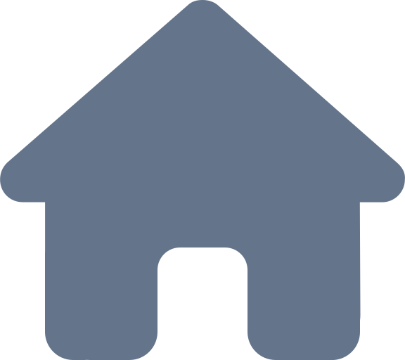
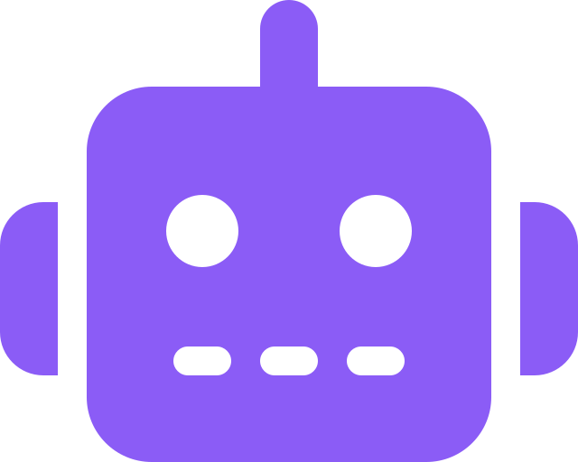
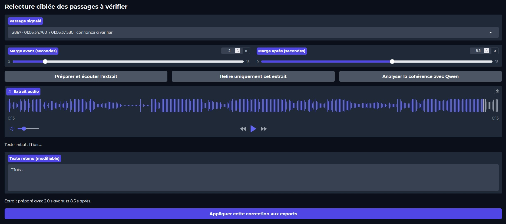
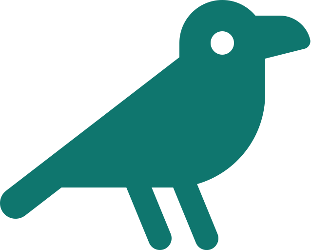
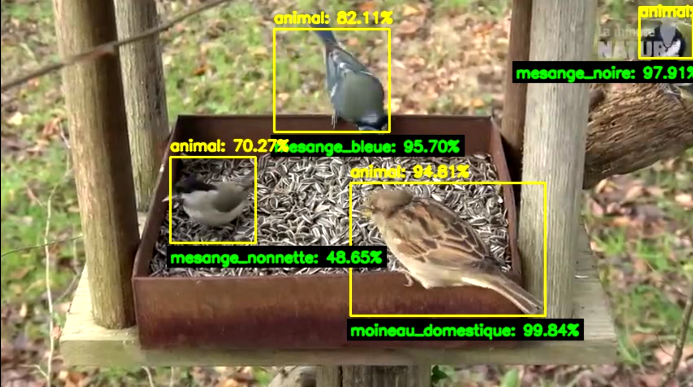
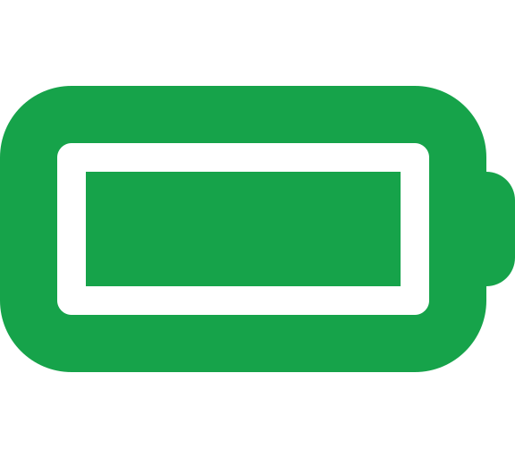
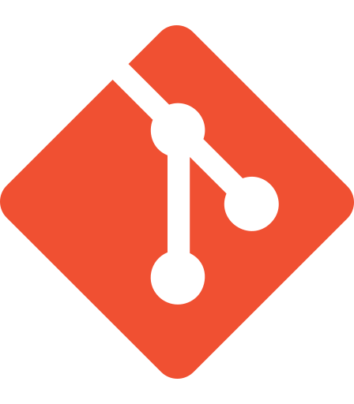

# Portfolio Data & Intelligence Artificielle

> **Analyse de données, IA appliquée et expérimentation technique** — des projets OpenClassrooms aux prototypes et études R&D.

Ce portfolio rassemble les projets réalisés dans le cadre du parcours **Data Analyst d'OpenClassrooms**, complétés par des réalisations personnelles autour de l'IA locale, de la vision par ordinateur, du traitement de la parole, de l'IoT et de l'acquisition de données.

Chaque sous-projet dispose de sa propre documentation : **contexte → besoin → données → démarche → résultats → limites → prochaines étapes**.

---

## Profil

**Data Analyst orienté IA appliquée**, avec un intérêt particulier pour la qualité des données, l'intégration de modèles dans des applications concrètes et l'expérimentation sur données réelles.

Deux axes structurent ce portfolio :

- **Data pour la décision** — SQL, Python, analyse exploratoire, Business Intelligence, Machine Learning, pipelines et qualité des données ;
- **IA appliquée & R&D** — vision, voix, LLM locaux, traitement de données non structurées, IoT et instrumentation.

---

# Compétences & outils

##  Parcours OpenClassrooms

| Outil | P3 | P4 | P5 | P6 | P7 | P8 | P9 | P10 | P11 | P12 | P13 |
| --- | :---: | :---: | :---: | :---: | :---: | :---: | :---: | :---: | :---: | :---: | :---: |
|  **Python** |  | ✓ |  | ✓ |  | ✓ | ✓ |  | ✓ | ✓ | ✓ |
|  **SQL** | ✓ |  | ✓ |  |  | ✓ |  |  |  |  |  |
|  **Pandas** |  | ✓ |  | ✓ |  | ✓ | ✓ |  | ✓ | ✓ | ✓ |
|  **Power BI** |  |  |  |  | ✓ |  |  | ✓ |  |  |  |
|  **Power Query / DAX** |  |  |  |  | ✓ |  |  | ✓ |  |  |  |
|  **dbt** |  |  |  |  |  | ✓ |  |  |  |  |  |
|  **Snowflake** |  |  |  |  |  | ✓ |  |  |  |  |  |
|  **Streamlit** |  |  |  |  |  |  | ✓ |  |  |  |  |
|  **Plotly** |  |  |  | ✓ |  |  | ✓ |  | ✓ | ✓ |  |
|  **scikit-learn** |  |  |  |  |  |  |  |  | ✓ | ✓ | ✓ |

##  Projets personnels & R&D

| Projet | Data | IA / ML | Vision | Audio | API / App | GPU | IoT / embarqué | R&D / expérimentation |
| --- | :---: | :---: | :---: | :---: | :---: | :---: | :---: | :---: |
| [Transcription locale](transcription_locale_reunions/) | ✓ | ✓ |  | ✓ | ✓ | ✓ |  | ✓ |
| [Vocal Weather](vocal_weather/) | ✓ | ✓ |  | ✓ | ✓ |  |  | ✓ |
| [Identification d'oiseaux](detection_especes_animales/) | ✓ | ✓ | ✓ |  |  | ✓ |  | ✓ |
| [Atelier IA](atelier_ia_place_du_numerique/) |  | ✓ | ✓ | ✓ | ✓ |  |  | ✓ |
| [OCR sur manuel ancien](ocr_documentaire/) | ✓ |  | ✓ |  |  |  |  | ✓ |
| [Tracker GPS / LoRa](collier_gps_lora/) | ✓ |  |  |  |  |  | ✓ | ✓ |
| [Diagnostic vibratoire](diagnostic_vibrations_automobile/) | ✓ |  |  |  |  |  | ✓ | ✓ |
| [Détection de moustiques](rnd_detection_moustiques/) |  | ✓ | ✓ |  |  |  |  | ✓ |
| [LLM locaux](evaluation_llm_locaux/) |  | ✓ |  |  | ✓ | ✓ |  | ✓ |
| [Batterie résidentielle DIY](rnd_batterie_residentielle_diy/) | ✓ |  |  |  |  |  | ✓ | ✓ |

---

#  Projets OpenClassrooms

##  P3 — Modélisation et interrogation SQL

  

Construction d'un modèle relationnel à partir d'un besoin de gestion : dictionnaire de données, clés primaires et étrangères, contrôle d'intégrité puis requêtes d'analyse.

Le projet documente le chemin complet **modélisation → chargement → vérification → interrogation SQL**.

➡️ [Voir le projet et les livrables](p3_modelisation_sql/)

---

##  P4 — Étude de santé publique

  
  
  

Analyse exploratoire de **quatre jeux de données FAO** : population, disponibilité alimentaire, sous-nutrition et aide alimentaire. Le travail porte sur l'harmonisation des sources, les jointures, la construction d'indicateurs et leur représentation géographique.

> **Point clé —** les résultats sont présentés dans leur contexte statistique, sans transformer une corrélation descriptive en relation causale.

➡️ [Voir le projet et les visualisations](p4_etude_sante_publique/)

---

##  P5 — Exploitation de données immobilières avec SQL

  

Structuration d'une base immobilière reliant ventes, biens, communes, départements et régions. Les requêtes permettent ensuite d'étudier les volumes de transactions, les prix régionaux et les prix au m².

➡️ [Voir le projet et le schéma relationnel](p5_donnees_immobilieres/)

---

##  P6 — Analyse du catalogue d'un caviste

  
  
  

Réconciliation de trois sources ERP / e-commerce puis analyse des prix, ventes, marges et stocks.

> **Résultat —** sur **825 références ERP**, **714 produits** sont rapprochés avec les données web et **111 références** restent à investiguer. L'analyse met aussi en évidence les références à forte couverture de stock.

➡️ [Voir le projet et les analyses](p6_analyse_catalogue_caviste/)

---

##  P7 — Tableau de bord de pilotage

  

Conception d'un dashboard Power BI pour suivre les projets IT et Marketing de l'entreprise fictive **Sanitoral** : coûts, délais, livrables et projets en alerte, avec navigation du niveau global jusqu'au détail projet.

  

➡️ [Voir le projet Power BI](p7_tableau_bord_powerbi/)

---

##  P8 — Pipeline sociodémographique

  
  
  

Pipeline Data Engineering sur **4 646 inscrits**, enrichis par des données INSEE. L'architecture dbt sépare les couches brutes, `staging`, intermédiaires et mart analytique.

> **Résultat —** le pipeline produit une table sociodémographique consolidée et exécute avec succès **43 modèles/tests/vérifications** lors du `dbt build` documenté.

➡️ [Voir le pipeline et le lineage dbt](p8_pipeline_sociodemographique/)

---

##  P9 — Analyse des ventes LaPage

  
  
  
  

Application Streamlit permettant d'explorer les ventes, les KPI, les produits et les profils clients de la librairie fictive **LaPage**, avec filtres temporels et analyses statistiques complémentaires.

➡️ [Voir le dashboard et les notebooks](p9_analyse_ventes_lapage/)

---

##  P10 — Accès à l'eau potable

  

Tableau de bord de priorisation pour l'organisation fictive **DWFA**. Les indicateurs croisent accès à l'eau, mortalité liée à l'eau/assainissement/hygiène, population et stabilité politique.

Le dashboard associe cartes, lecture régionale et matrice de priorisation afin d'orienter l'analyse vers les zones nécessitant une étude plus approfondie.

➡️ [Voir le projet et les cartes](p10_acces_eau_potable/)

---

##  P11 — Étude de marché internationale

  
  
  

Étude destinée à prioriser des marchés export dans la filière volaille à partir de données FAO, Banque mondiale, WGI et CEPII. ACP, CAH et K-means sont utilisés conjointement pour construire une segmentation interprétable.

> **Résultat —** **quatre profils de marchés** sont retenus ; la recommandation privilégie les marchés riches, stables et importateurs, puis les marchés intermédiaires équilibrés.

➡️ [Voir l'étude, l'ACP et le clustering](p11_etude_marche_internationale/)

---

##  P12 — Détection de faux billets

  
  
  

Comparaison de régression logistique, KNN, Random Forest et K-means sur **1 500 billets**, avec traitement des valeurs manquantes, validation croisée et analyse du coût métier des erreurs.

> **Résultat —** avec le modèle retenu et un seuil de **0,65**, les essais atteignent **100 % de rappel sur les faux billets** du jeu de test, au prix de trois vrais billets classés comme suspects. Ce seuil reste à revalider sur données indépendantes.

➡️ [Voir le projet, le modèle et la matrice de confusion](p12_detection_faux_billets/)

---

##  P13 — Projet Data augmenté avec l'IA

  
  
  

Dernier projet du parcours : amélioration critique du P6 avec l'IA, veille technologique, cahier des charges, comparaison d'options, traçabilité des essais et construction du portfolio.

**État actuel :** la partie portfolio est engagée ; l'amélioration IA du P6 reste à réaliser et sera documentée séparément avec ses prompts, variantes, décisions et limites.

➡️ [Voir l'état du P13](p13_data_augmente_ia/)

---

#  Projets personnels — IA appliquée

##  Transcription locale et assistée de réunions

  
  
  
  

Application locale destinée à transformer de longues réunions en documents exploitables sans envoyer les médias vers un service de transcription distant : Whisper large-v3, diarisation optionnelle, exports TXT/SRT/VTT et correction humaine traçable.

> **Contrôle qualité —** les **30 segments acoustiquement les moins fiables** sont remontés pour réécoute et redécodage ciblé, sans retraiter l'intégralité de la réunion.

  

➡️ [Voir l'application et son pipeline](transcription_locale_reunions/)

---

##  Vocal Weather — Assistant météo vocal

  
  
  
  
  

Prototype fonctionnel combinant application Flutter et API FastAPI : **voix → transcription → extraction du lieu et de l'horizon → Open-Meteo → réponse → synthèse vocale**.

Chaque requête est historisée et les étapes du pipeline sont journalisées avec leur durée, ce qui permet d'observer les latences réelles plutôt que d'annoncer une valeur théorique unique.

  

➡️ [Voir le prototype](vocal_weather/)

---

##  Détection et identification d'oiseaux

  
  
  

Pipeline de vision combinant détection d'animaux, classification d'espèces et analyse vidéo sur des séquences de mangeoire. Plusieurs versions ConvNeXt-Small ont été entraînées et comparées sur GPU.

> **Résultat —** le modèle de référence **ConvNeXt-Small v4 atteint 91,11 % d'accuracy** sur **4 094 images de test**, après entraînement sur **19 061 images** couvrant 12 espèces locales.

  

➡️ [Voir le projet et le suivi des entraînements](detection_especes_animales/)

---

##  Atelier « Comprendre l'IA par la démonstration »

  
  
  

Conception d'un atelier de **45 minutes** pour Place du Numérique 2026. Six démonstrations rendent visibles les briques techniques derrière la voix, la vision, la biométrie et l'IA générative, tout en abordant biais, consentement et vérification des contenus.

**Démonstrations :** assistant météo vocal · classification d'oiseaux · comptage de véhicules · reconnaissance faciale · face swap · conversion vocale.

➡️ [Voir l'atelier et les supports PDF](atelier_ia_place_du_numerique/)

---

#  Études & projets R&D

Ces projets sont présentés selon leur **état réel** : retour d'expérience, étude de faisabilité, préparation expérimentale ou prototype. Une hypothèse ou une simulation n'est pas présentée comme une mesure terrain.

##  OCR sur manuel ancien

Essai d'OCR sur un bulletin technique CIMA de 1957. La dégradation du support, le contraste irrégulier et les typographies anciennes produisent trop d'erreurs pour obtenir un résultat exploitable.

> **Décision technique —** ne pas présenter un traitement non fiable comme une solution aboutie ; conserver l'essai comme retour d'expérience sur les limites de l'OCR.

➡️ [Voir le retour d'expérience](ocr_documentaire/)

---

##  Diagnostic vibratoire automobile

  
  

Instrumentation prévue avec **2 EVAL-ADXL357Z**, ESP32 et vitesse véhicule OBD2 afin de corréler accélérations, vitesse et fréquences dominantes. La campagne instrumentée sur véhicule reste à réaliser.

➡️ [Voir le protocole et le schéma d'acquisition](diagnostic_vibrations_automobile/)

---

##  Tracker GPS / LoRa basse consommation

Conception d'un tracker GNSS/LoRa/BLE adapté à un animal, avec adaptation des cycles de localisation à l'activité et à l'état de batterie.

> **Essai terrain —** des cartes Heltec WiFi LoRa 32 V3 / SX1262 avec antennes d'origine ont atteint environ **2,5 km** dans les conditions du test avec **SF10**. Les anciennes estimations d'autonomie restent explicitement séparées des futures mesures sur prototype final.

  

➡️ [Voir le projet R&D](collier_gps_lora/)

---

##  Détection et suivi automatisé de moustiques

Étude d'une architecture capable de détecter une cible de quelques millimètres, d'estimer sa trajectoire et d'assurer un suivi temps réel. Vision, mesure optique/LiDAR et galvanomètres sont comparés avant prototypage.

> **Verrou identifié —** la détection fiable constitue le principal problème ; une reconstruction 3D complète n'est pas nécessairement indispensable si la zone de détection peut être contrainte.

➡️ [Voir le schéma conceptuel](rnd_detection_moustiques/)

---

##  Évaluation de LLM locaux

  
  

Expérimentation de modèles exécutés localement pour des usages de développement : compatibilité, vitesse, mémoire, respect des consignes et comportement sur du code. Les essais existent, mais le benchmark reproductible reste à formaliser avant publication de conclusions comparatives.

➡️ [Voir l'état de l'étude](evaluation_llm_locaux/)

---

##  Batterie résidentielle DIY

Étude technique et économique d'un stockage résidentiel DIY : dimensionnement, coût/kWh, cyclabilité, rendement, contraintes de sécurité et comparaison de chimies, notamment autour du zinc-ion.

Le projet reste volontairement au stade de l'étude : aucune batterie résidentielle complète n'est présentée comme réalisée ou validée.

➡️ [Voir l'étude et le schéma conceptuel](rnd_batterie_residentielle_diy/)

---

# Environnement technique

  
  
  
  
  
  
  
  
  
  
  
  
  

---

## À propos du portfolio

Les projets OpenClassrooms utilisent des données pédagogiques, fictives ou ouvertes selon les cas. Les projets personnels ne publient que les données, médias et éléments techniques pouvant être diffusés.

Les fiches distinguent volontairement **résultat mesuré**, **prototype fonctionnel**, **hypothèse**, **étude de faisabilité** et **travail à poursuivre**.

**GitHub :** [Fighter777](https://github.com/Fighter777)
