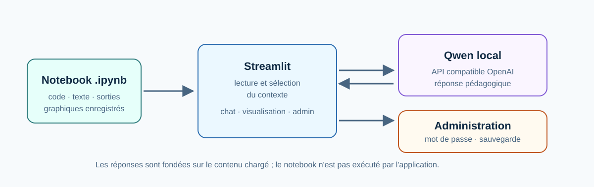
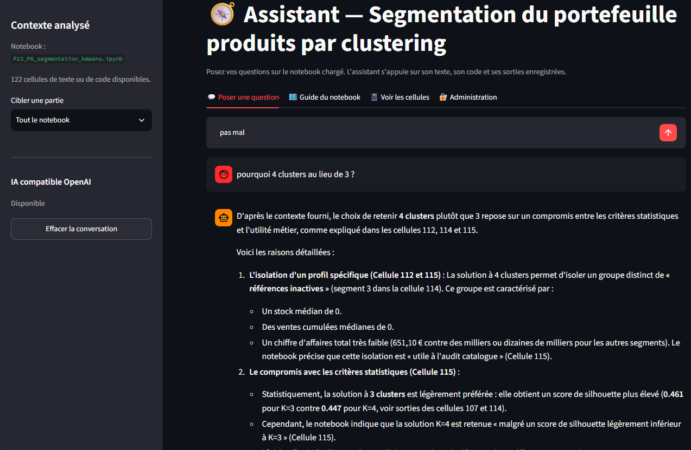
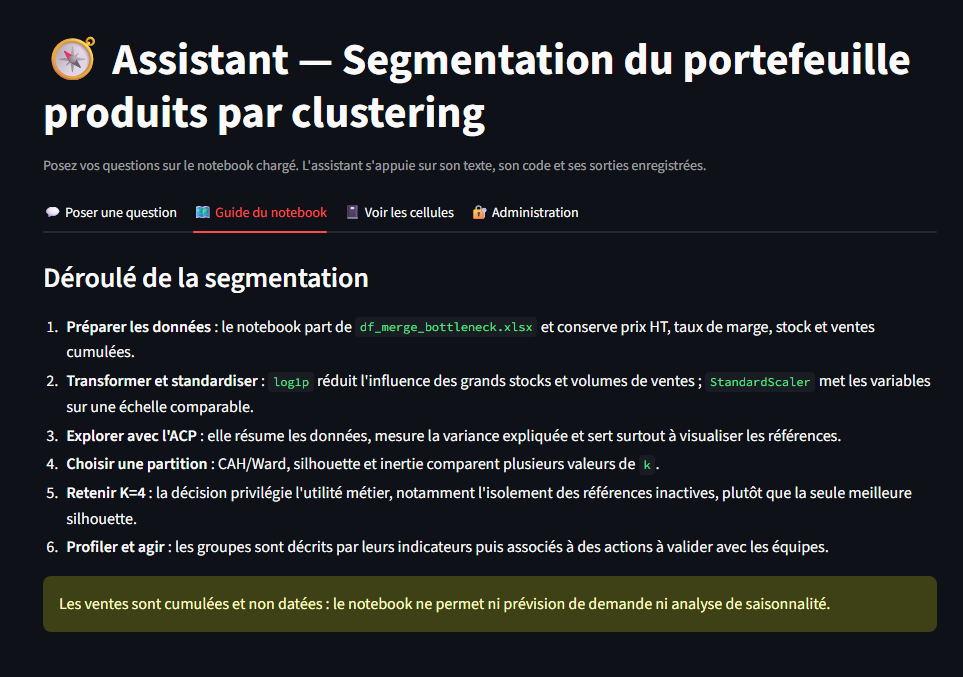

<a href="../README.md">← Retour au portfolio</a>

#  Assistant IA de lecture de notebook

  
  
  

---

  
   
  Lecture contextualisée d'un notebook Jupyter, avec assistant Qwen local facultatif

## 📋 Contexte

Outil développé dans le cadre de l'amélioration P13 du projet P6 OpenClassrooms. Il rend un notebook de segmentation plus accessible en permettant de questionner son code, sa démarche et ses résultats enregistrés, sans parcourir toutes ses cellules manuellement.

➡️ [Voir le code source](https://github.com/Fighter777/assistant_IA_notebook)

## 📈 Aperçu de l'interface

  
   
  Réponse contextualisée à une question sur le choix du nombre de groupes

  
   
  Guide synthétique pour accompagner la lecture du notebook

## 🎯 Objectif

Faciliter la relecture, la transmission et l'explication d'un notebook analytique. L'IA répond à partir du contenu chargé et signale ce qui n'y figure pas.

## ✨ Fonctionnalités

- lecture du code Python, des cellules Markdown et des sorties textuelles sauvegardées ;
- affichage des graphiques et images produits dans le notebook ;
- questions-réponses en français, avec filtre par étape de l'analyse ;
- intégration d'un modèle local compatible API OpenAI, dont Qwen ;
- guide synthétique et consultation cellule par cellule ;
- administration protégée : import d'un `.ipynb`, validation, sauvegarde et remplacement ;
- proposition et édition d'un titre d'application par l'IA.

## 🧩 Architecture

**Notebook Jupyter embarqué → lecteur Python → Streamlit → contexte sélectionné → Qwen local facultatif**

Le notebook est conservé dans `data/`. Lors d'un remplacement, la version précédente est archivée dans `data/sauvegardes_notebook/`.

## ⚙️ Démarche

1. L'application extrait cellules, texte, sorties et images du notebook.
2. L'utilisateur cible tout le document ou une étape précise avant sa question.
3. Le contexte correspondant est transmis au modèle local avec un cadrage pédagogique.
4. Les cellules source restent consultables afin de confronter la réponse de l'IA au contenu réel.
5. L'administrateur peut charger une nouvelle version après validation de sa structure JSON.

## 🎓 Compétences mobilisées

- conception d'interface Streamlit ;
- intégration d'un LLM local compatible OpenAI ;
- extraction structurée de notebooks Jupyter ;
- gestion de contexte et traçabilité des sources ;
- sécurisation d'opérations d'administration ;
- médiation de résultats d'analyse.

## ⚠️ Limites

- l'application n'exécute pas le notebook : les résultats correspondent à ses sorties sauvegardées ;
- les graphiques sont visibles, mais leur interprétation automatique demanderait un modèle avec capacité de vision ;
- une réponse IA reste une aide à la lecture et doit être confrontée au code et aux données ;
- le mot de passe d'administration convient à un usage local, non à un déploiement multi-utilisateur.

## 🚀 Prochaines pistes

- support explicite des modèles de vision ;
- indexation sémantique des très grands notebooks ;
- export d'une conversation documentée ;
- authentification et gestion des rôles pour un déploiement partagé.

---

[← Retour au portfolio](../README.md)
