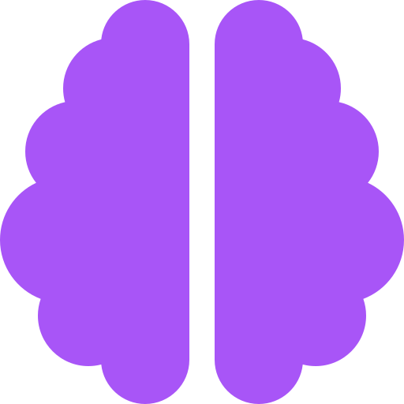
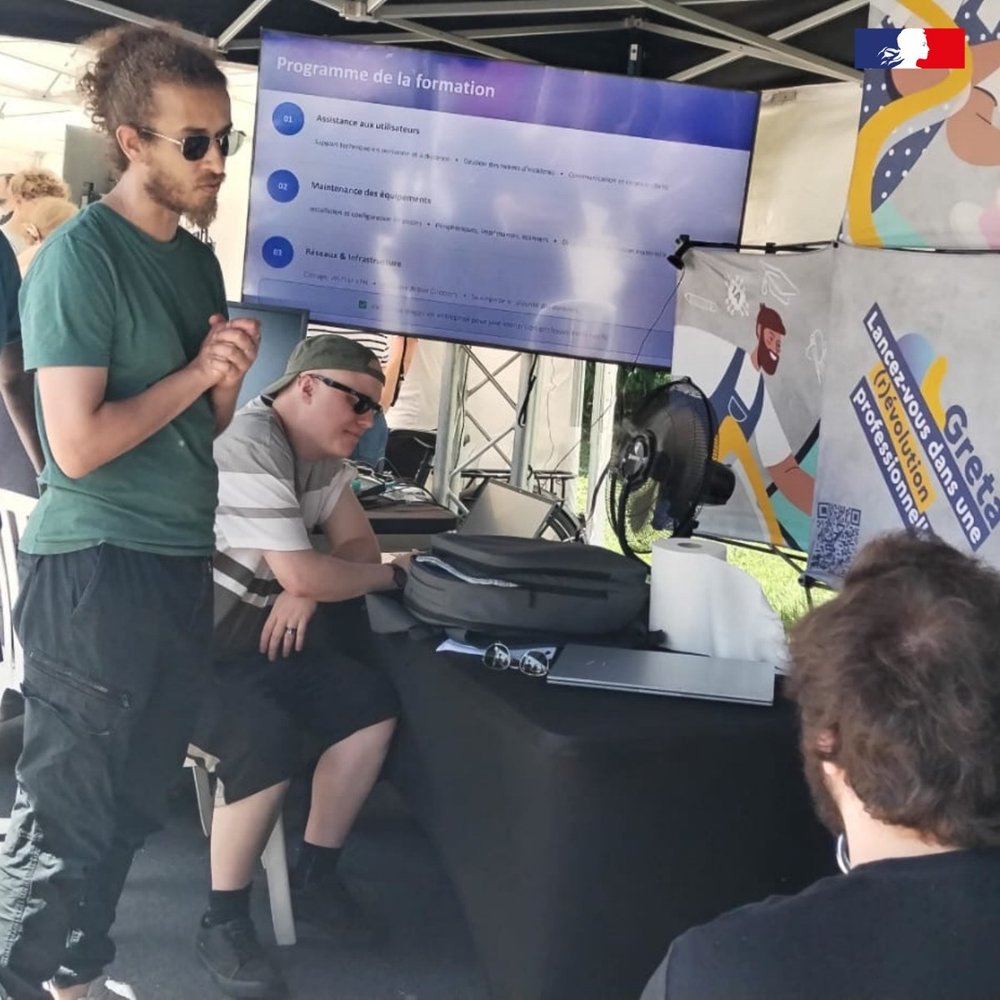

<a href="../README.md">← Retour au portfolio</a>

#  Atelier « Comprendre l'IA par la démonstration » — Place du Numérique 2026

  
  
  

---

  

## Contexte

Conception d'un atelier de 45 minutes consacré à l'intelligence artificielle pour **Place du Numérique 2026**, avec une approche fondée sur des démonstrations concrètes pour un public varié.

## Besoin / objectif

Montrer comment différentes briques d'IA peuvent être combinées dans des applications réelles, tout en expliquant leurs limites, leurs biais et la nécessité de valider leurs résultats.

## Démonstrations

- assistant météo vocal ;
- classification d'oiseaux ;
- détection et comptage de véhicules ;
- reconnaissance faciale ;
- face swap ;
- conversion vocale.

Les démonstrations de visage et de voix synthétiques servent aussi à aborder le consentement, les risques de manipulation et la nécessité de vérifier les contenus.

## Démarche

Chaque démonstration isole une ou plusieurs étapes d'une chaîne de traitement :

**acquisition → prétraitement → modèle → interprétation → restitution**

L'objectif est de rendre visibles les composants techniques généralement masqués derrière une interface utilisateur.

## Compétences mobilisées

- intégration de modèles d'IA ;
- Computer Vision ;
- traitement automatique de la parole ;
- modèles de langage ;
- API ;
- analyse critique des résultats ;
- vulgarisation technique.

## Résultats / état

Un support de présentation de 45 minutes relie les démonstrations aux notions d'IA, à leurs limites et à leurs usages responsables. Les projets présentés sont distingués des modèles et outils tiers utilisés pour les démontrer.

## Limites

- dépendance aux modèles préentraînés ;
- performances sensibles aux données d'entrée ;
- démonstrations non destinées à constituer un benchmark scientifique.

## Prochaines pistes

- recueillir les retours du public pour faire évoluer le format ;
- adapter le niveau de détail technique au public ;
- maintenir les démonstrations et leur cadre éthique à jour.

## Livrable

- [Support de présentation — Place du Numérique 2026 (PDF)](livrables/atelier_ia_place_du_numerique_2026.pdf)
- [Atelier en images (PDF)](livrables/atelier_ia_place_du_numerique_2026_en_images.pdf)

## Références techniques

Les démonstrations de conversion vocale et de visage synthétique s'appuient sur des dépôts dérivés d'outils open source. Ils ont été mis à jour et, selon les besoins de démonstration, adaptés. Les projets sources restent crédités ; les modèles et médias associés ne sont pas publiés.

Ils sont présentés dans un cadre pédagogique, avec une attention particulière au consentement et aux risques de manipulation.

- [Retrieval-based Voice Conversion WebUI](https://github.com/Fighter777/Retrieval-based-Voice-Conversion-WebUI)
- [DeepFaceLive](https://github.com/Fighter777/DeepFaceLive)
- [DeepixLab](https://github.com/Fighter777/DeepixLab)
- [DeepFaceLab](https://github.com/Fighter777/DeepFaceLab)

---

[← Retour au portfolio](../README.md)
