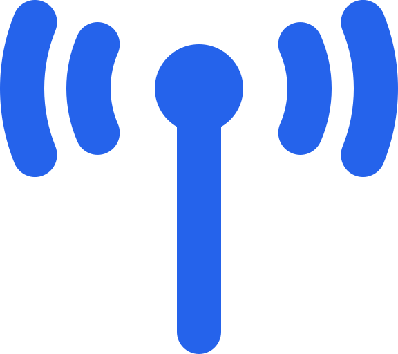
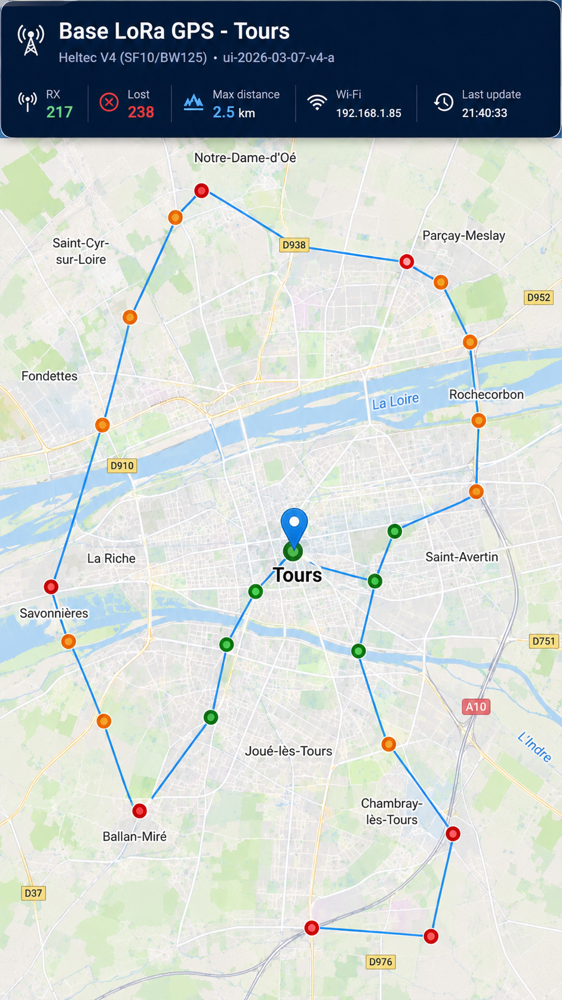

<a href="../README.md">← Retour au portfolio</a>

#  Tracker GPS / LoRa basse consommation pour animal

---

  
   
  Maquette de visualisation des essais GPS / LoRa

##  Contexte

Projet personnel de R&D visant à concevoir un dispositif de localisation compact, autonome et adapté au port par un chat.

Le projet est né d'un retour d'usage : lors d'un essai d'un collier GPS/GSM Weenect, une couverture GSM insuffisante a entraîné une décharge de la batterie en environ trois jours. Cette observation a motivé l'étude d'une solution plus sobre et mieux adaptée à un environnement rural.

##  Besoin / objectif

Le système doit :
- déterminer sa position par GNSS ;
- transmettre les informations utiles en LoRa ;
- préserver l'autonomie lorsque la couverture mobile est limitée ;
- utiliser le BLE pour les échanges locaux ;
- exploiter un IMU pour détecter l'activité ;
- adapter son fonctionnement au mouvement et à la batterie ;
- fonctionner avec plusieurs stations de réception.

##  Architecture

- microcontrôleur Nordic ;
- SX1262 ;
- u-blox M10S ;
- IMU LIS2 ;
- BLE ;
- stockage selon la variante matérielle ;
- composant sécurisé pour identité / clés ;
- LiPo ;
- LED, buzzer et vibration.

##  Données

- coordonnées GNSS ;
- état de mouvement ;
- batterie ;
- état système ;
- heartbeat.

##  Autonomie : état de la conception

L'objectif est de minimiser la consommation moyenne en adaptant les cycles GNSS et les transmissions à l'activité et au contexte. Une ancienne estimation de dimensionnement existe, mais elle précède l'architecture matérielle actuellement retenue ; elle n'est donc pas utilisée comme résultat du projet.

### Estimation historique

Une première modélisation, fondée sur une veille estimée à environ 8 µA, donnait les ordres de grandeur suivants :

- scénario de 23 h en mode `HOME` et 1 h en mode `AWAY` : environ **2,30 mAh/jour** ;
- avec une pile CR2477 estimée à environ 600 mAh utilisables : environ **260 jours**, soit **8,5 mois**, théoriques ;
- mode presque exclusivement `HOME` : environ **0,057 mAh/jour**.

Ces chiffres sont des estimations de conception antérieures au choix définitif des composants. Ils ne constituent ni une consommation mesurée ni une autonomie annoncée pour l'architecture finale.

La consommation finale devra être caractérisée sur prototype avec la nomenclature matérielle retenue, puis confrontée à l'autonomie observée.

##  Démarche

1. définition fonctionnelle ;
2. sélection des composants ;
3. arbitrage portée / autonomie / encombrement ;
4. essais radio ;
5. définition du protocole ;
6. conception électronique ;
7. firmware ;
8. validation terrain.

##  Expérimentation LoRa

Des essais terrain avec des **Heltec WiFi LoRa 32 V3 / SX1262** et les antennes d'origine ont permis d'obtenir environ **2,5 km** dans les conditions de test avec **SF10**.

Ces essais servent de base au dimensionnement de l'architecture radio finale.

##  Compétences mobilisées

- IoT ;
- systèmes embarqués ;
- GNSS ;
- LoRa ;
- BLE ;
- acquisition de données ;
- optimisation énergétique ;
- protocoles ;
- sécurité matérielle ;
- expérimentation terrain.

##  Limites

- consommation GNSS ;
- compromis fréquence des positions / autonomie ;
- influence de l'environnement radio ;
- contraintes mécaniques et thermiques.

##  Prochaines étapes

- finaliser l'architecture ;
- réaliser le PCB ;
- mesurer les consommations par phase et recalculer l'autonomie avec la BOM finale ;
- valider le GNSS ;
- finaliser le protocole LoRa ;
- intégrer les stations de réception.

##  Publication

Projet présenté comme preuve de démarche R&D.

Le code source, les fichiers de conception détaillés et certains éléments d'implémentation ne sont pas publiés. Le dépôt de développement privé n'est pas référencé.

---

[← Retour au portfolio](../README.md)
