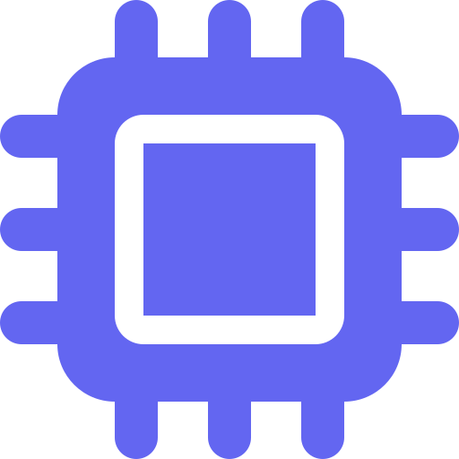
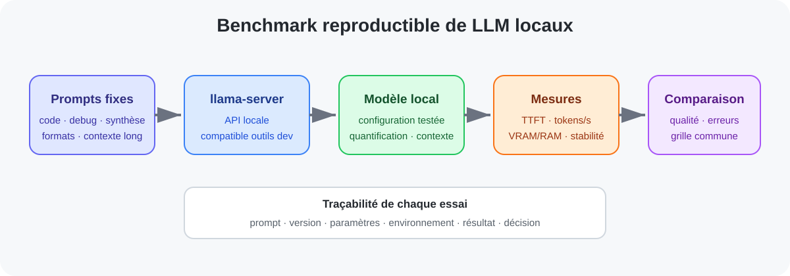

<a href="../README.md">← Retour au portfolio</a>

#  Évaluation de modèles de langage exécutés localement

  
  

---

  
   
  Architecture du benchmark reproductible de LLM locaux

##  Contexte

Expérimentation de modèles de langage exécutés localement afin d'évaluer leur intérêt pour des usages de développement et d'assistance technique, sans dépendre systématiquement d'un service distant.

Le projet s'inscrit dans une démarche de comparaison pratique : compatibilité, performances, comportement sur des tâches réelles et contraintes matérielles.

##  Besoin / objectif

Déterminer quelles configurations sont réellement utilisables localement selon plusieurs critères :

- qualité des réponses ;
- respect des consignes ;
- vitesse de génération ;
- consommation mémoire ;
- stabilité ;
- compatibilité avec les outils ;
- capacité à travailler sur du code.

##  Environnement

Les essais ont notamment porté sur :
- `llama-server` ;
- API locale compatible avec des outils de développement ;
- OpenCode ;
- modèles Qwen récents, dont **Qwen 3.8** dans la configuration actuelle.

**[À compléter]** :
- modèle exact / quantification ;
- GPU utilisé pour chaque essai ;
- paramètres ;
- taille de contexte.

##  Démarche

Pour rendre l'étude exploitable, les essais peuvent être structurés sur un jeu fixe de tâches :

1. compréhension d'un besoin ;
2. génération ou modification de code ;
3. débogage ;
4. synthèse ;
5. respect d'un format ;
6. travail sur un contexte long.

Pour chaque modèle :
- conserver le prompt ;
- mesurer la latence ;
- relever les tokens/s ;
- mesurer VRAM / RAM ;
- noter les erreurs ;
- évaluer la qualité selon une grille commune.

##  Compétences mobilisées

- LLM locaux ;
- inférence ;
- benchmarking ;
- API ;
- intégration d'outils ;
- mesure de performances ;
- évaluation qualitative ;
- reproductibilité.

##  État actuel

Plusieurs moteurs et modèles ont déjà été testés en conditions réelles.

Le projet doit encore être **formalisé sous forme de benchmark reproductible** avant de présenter des conclusions comparatives définitives.

##  Résultats

**[À compléter à partir d'une campagne standardisée]**

Exemples de mesures à publier :
- tokens/s ;
- temps au premier token ;
- VRAM ;
- réussite / échec sur tâches ;
- qualité de modification de code ;
- stabilité sur contexte long.

##  Limites

- jugement qualitatif partiellement subjectif ;
- résultats dépendants de la quantification et des paramètres ;
- versions des modèles et moteurs évoluant rapidement ;
- comparaison matérielle à normaliser.

##  Prochaines étapes

- définir un jeu de prompts stable ;
- automatiser les mesures ;
- conserver les versions exactes ;
- comparer plusieurs modèles sur le même matériel ;
- produire une synthèse multicritère.

---

[← Retour au portfolio](../README.md)
