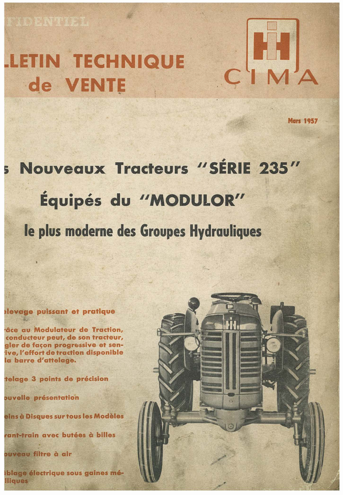

# Retour d'expérience R&D — OCR sur manuel ancien

> **Statut :** essai non retenu comme projet abouti.

## Objectif initial

Numériser et rendre exploitable un manuel des années 1950 par OCR.

## Source étudiée

Le travail porte sur un bulletin technique CIMA de mars 1957, consacré aux tracteurs « série 235 ».

## Constat

Malgré plusieurs essais, la qualité du scan et l'état du document ne permettent pas une extraction suffisamment fiable. La dégradation du support, le contraste irrégulier et les typographies anciennes génèrent trop d'erreurs pour produire un résultat exploitable.

## Décision

Le projet est conservé comme retour d'expérience sur les limites de l'OCR face à une source dégradée, mais n'est pas présenté comme une solution finalisée ni comme un projet sélectionné du portfolio.

## Conditions pour le reprendre

- obtenir une meilleure numérisation ou un exemplaire mieux conservé ;
- définir un niveau de fiabilité minimal acceptable ;
- évaluer le coût d'une restauration des images ou d'une transcription manuelle.
