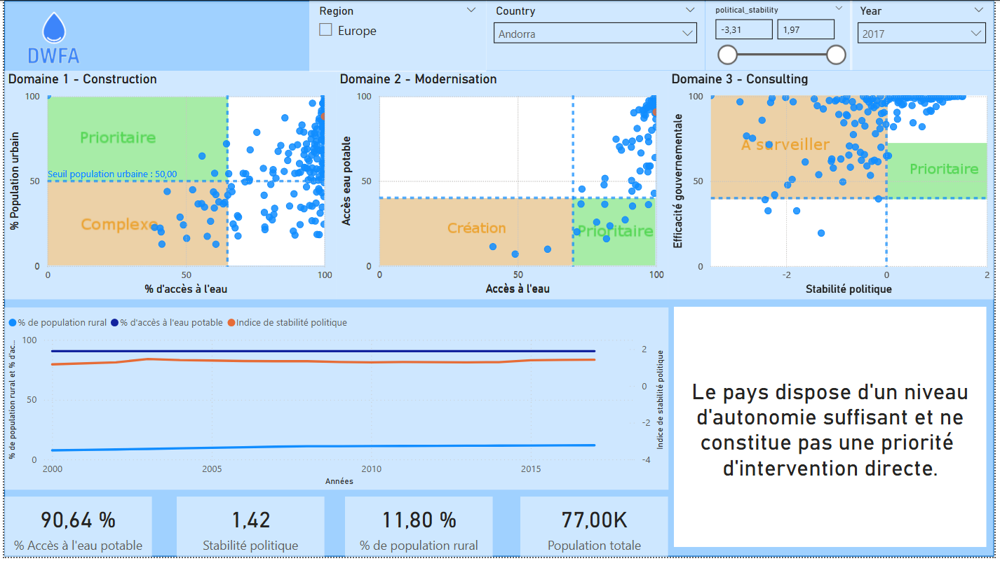
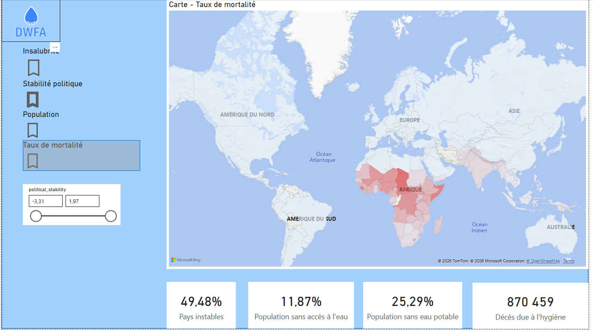
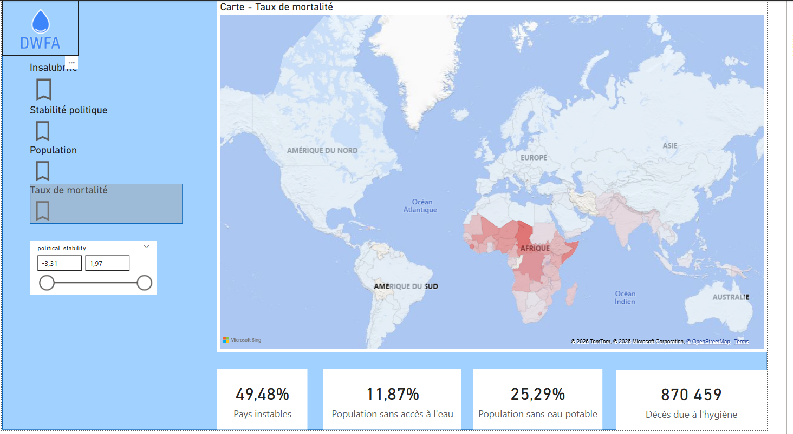
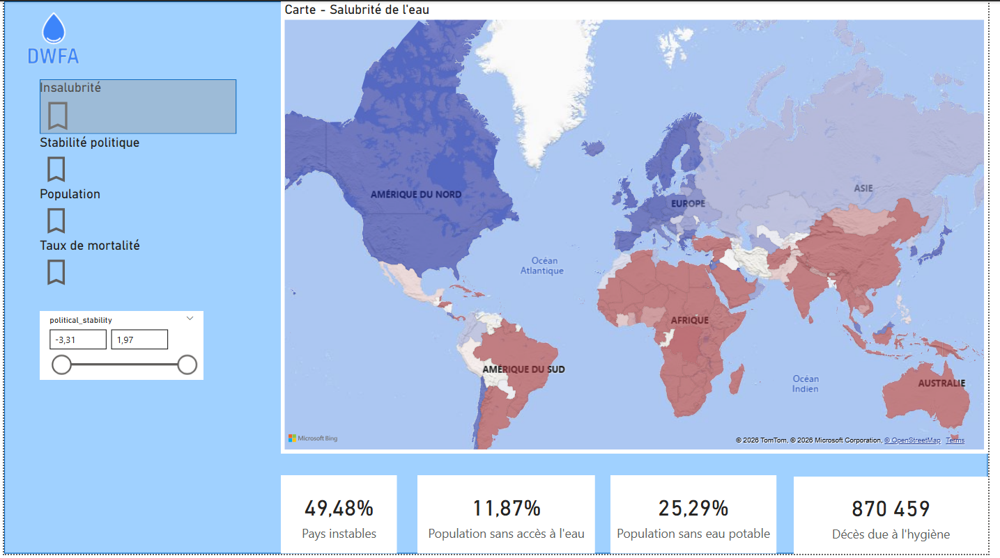
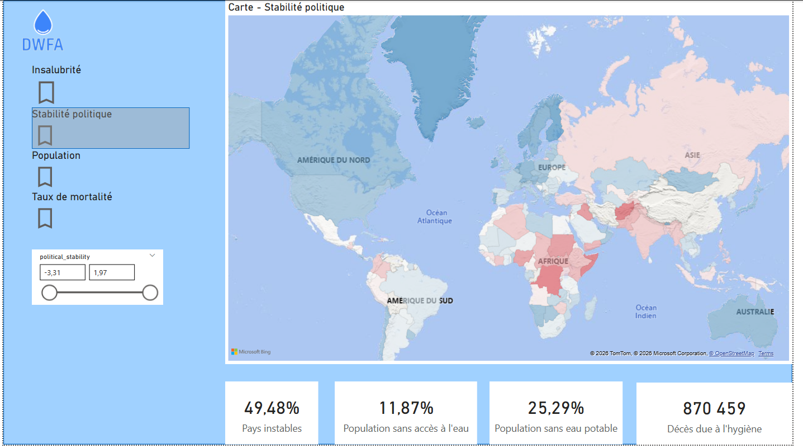
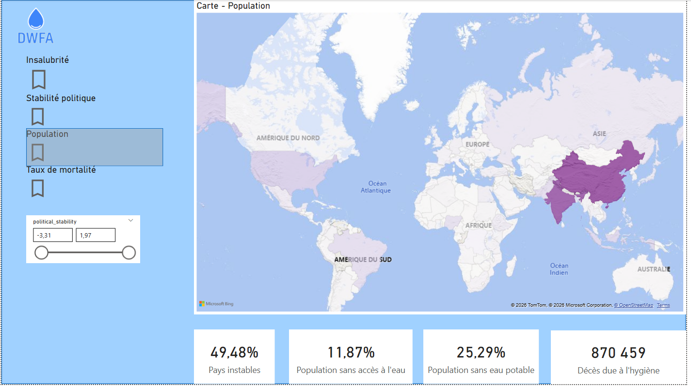
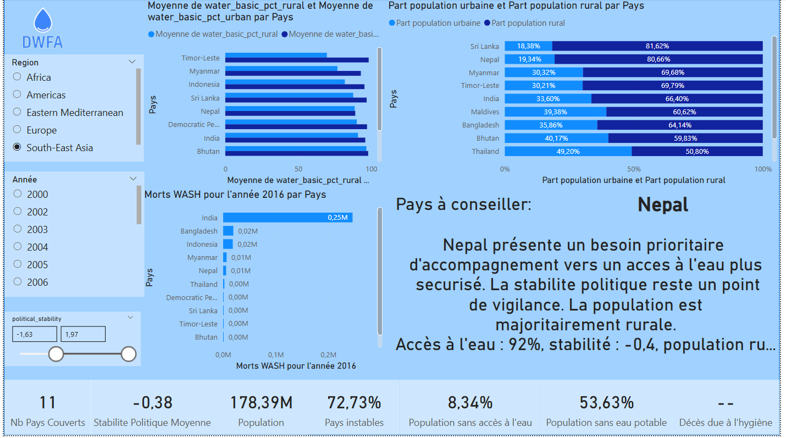

<a href="../README.md">← Retour au portfolio</a>

#  P10 — Accès à l'eau potable

  

---

  
   
  Matrice de priorisation des interventions

## 📋 Contexte

Projet Data Analyst consacré à l'analyse des conditions d'accès à l'eau potable pour l'organisation fictive DWFA.

## 🎯 Objectif

Construire une base d'analyse et un tableau de bord pour identifier les pays et populations à prioriser.

## 🗃️ Données analysées

- accès aux services d'eau potable de base et gérés en toute sécurité ;
- mortalité attribuable à des facteurs liés à l'eau, l'assainissement et l'hygiène ;
- stabilité politique ;
- population et correspondance pays-région.

Les séries couvrent principalement les années 2000 à 2017, selon la source.

## ⚙️ Démarche

- contrôle, documentation et préparation des jeux de données ;
- création d'indicateurs de priorisation ;
- conception d'une maquette puis d'un tableau de bord Power BI ;
- restitution à travers des pages KPI, d'analyse géographique et de comparaison des facteurs.

## 📈 Livrable et aperçus

Le tableau de bord interactif est disponible dans [livrables/P10_tableau_bord_acces_eau_potable.pbix](livrables/P10_tableau_bord_acces_eau_potable.pbix).

### Cartographie des indicateurs

Les pages géographiques rendent les écarts immédiatement lisibles et permettent de filtrer les résultats par niveau de stabilité politique.

  

  

  

  

  

### Lecture régionale et priorisation

Une vue régionale synthétise les indicateurs et formule une recommandation contextualisée. La page de priorisation met en regard accès à l'eau, population rurale et stabilité politique.

  

## 🎓 Compétences mobilisées

Power BI, Power Query, modélisation de données, analyse exploratoire, visualisation et data storytelling.

## ⚠️ Limites

Les indicateurs internationaux sont agrégés et n'ont pas tous la même période de disponibilité. Ils orientent une priorisation à l'échelle pays, sans remplacer une étude locale.

---

[← Retour au portfolio](../README.md)
