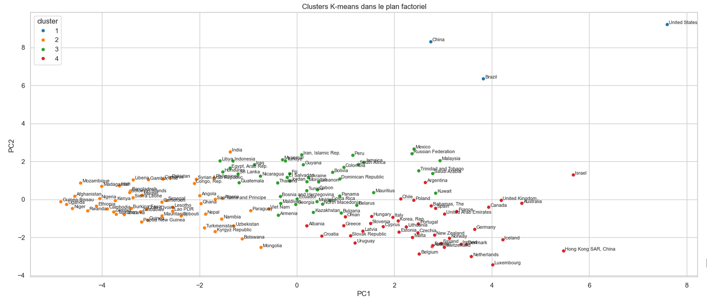
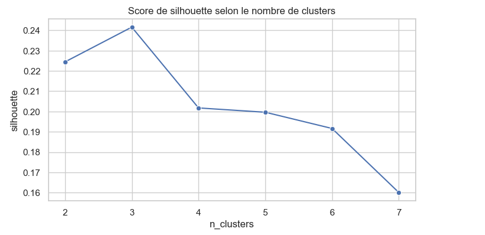
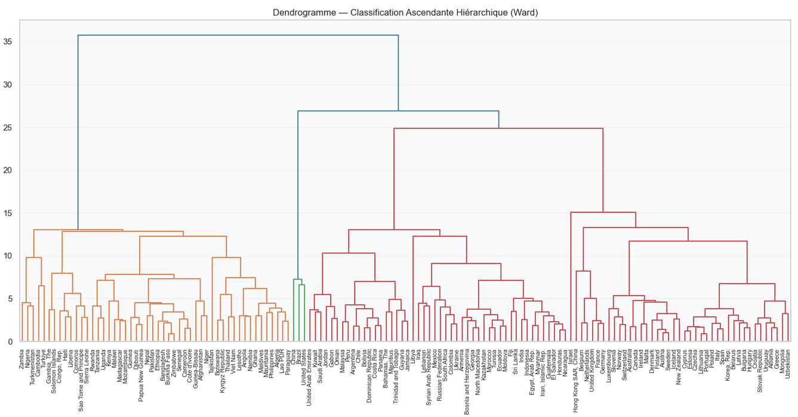
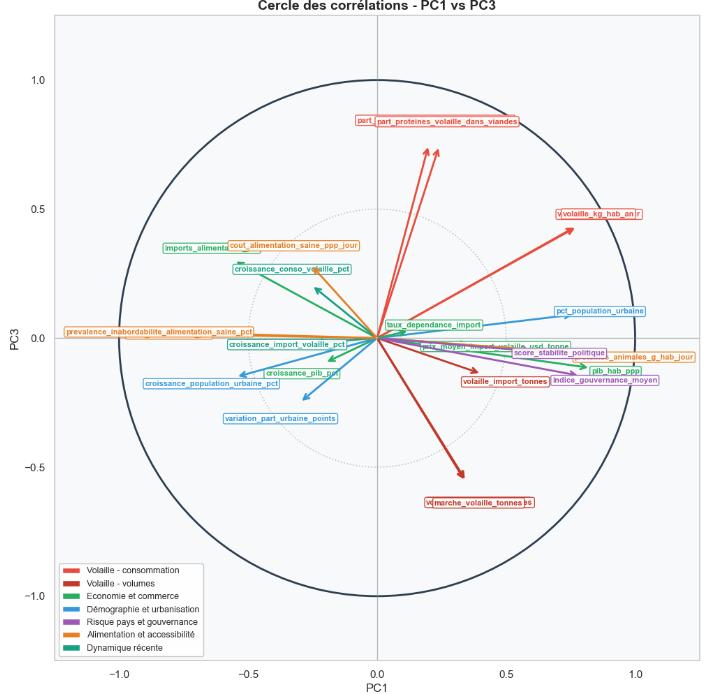

<a href="../README.md">← Retour au portfolio</a>

#  P11 — Étude de marché internationale

  
  
  
  

---

  
   
  Projection des clusters K-means sur le plan factoriel

##  Contexte

Projet d'analyse réalisé dans le parcours **Data Analyst OpenClassrooms** pour orienter le développement international d'un acteur de la filière volaille.

##  Besoin métier

Comparer les marchés internationaux de la volaille afin de prioriser des pays cibles pour une stratégie d'export.

##  Données

Les données regroupent des indicateurs internationaux de consommation, production, importation et prix de la volaille, enrichis par des données économiques, démographiques, alimentaires et de gouvernance. Les sources mobilisées comprennent notamment la FAO, la Banque mondiale, les indicateurs de gouvernance WGI et le CEPII.

Les indicateurs de dynamique couvrent principalement la période 2013–2017, selon la disponibilité des sources.

##  Démarche

1. préparation et rapprochement des sources pays ;
2. construction d'indicateurs de marché, dépendance aux importations, demande et risque pays ;
3. analyse exploratoire et standardisation ;
4. ACP pour réduire la redondance entre variables ;
5. comparaison CAH et K-means ;
6. caractérisation des groupes ;
7. recommandations commerciales.

##  Compétences mobilisées

- données externes ;
- EDA ;
- statistiques ;
- segmentation ;
- interprétation métier.

##  Livrables

- [Préparation, nettoyage et analyse exploratoire](livrables/P11_preparation_nettoyage_analyse_exploratoire.ipynb)
- [Clustering et visualisations](livrables/P11_clustering_visualisations.ipynb)
- [Présentation de synthèse (PDF)](livrables/P11_presentation_etude_marche_volaille.pdf)

##  Résultats

L'ACP met notamment en évidence la maturité commerciale, la taille du marché de la volaille, le poids de la volaille dans l'alimentation et la dépendance aux importations. La sélection finale de **quatre clusters** s'appuie sur une lecture croisée du dendrogramme, du coude et du score de silhouette.

Les quatre profils identifiés sont :

- géants producteurs déjà installés ;
- marchés émergents, fragiles mais dynamiques ;
- marchés intermédiaires attractifs ;
- marchés riches, stables et importateurs.

La recommandation privilégie les marchés riches et importateurs, puis les marchés intermédiaires équilibrés. Il s'agit d'une aide à la priorisation et non d'une décision d'implantation autonome.

##  Aperçu des analyses

Le nombre de groupes a été confronté à plusieurs critères. Le score de silhouette permet notamment de comparer la cohésion des partitions testées.

  

Le dendrogramme issu de la CAH par méthode de Ward donne une lecture complémentaire des rapprochements entre pays.

  

La projection dans le plan factoriel rend visible la répartition des quatre clusters retenus.

Le cercle des corrélations aide à interpréter les axes de l'ACP et les familles d'indicateurs qui structurent les profils de marché.

  

##  Limites

- qualité variable des sources ;
- données manquantes ;
- décalages temporels ;
- limites de segmentation.
- les indicateurs « bio » éventuels décrivent un marché bio global, pas une demande spécifique de volaille bio.

##  Prochaines pistes

- actualiser les données ;
- intégrer de nouveaux indicateurs ;
- tester la stabilité des groupes ;
- compléter l'analyse par des contraintes réglementaires et des données de terrain pays par pays.

---

[← Retour au portfolio](../README.md)
