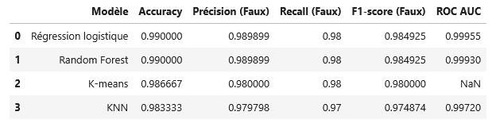
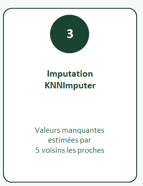
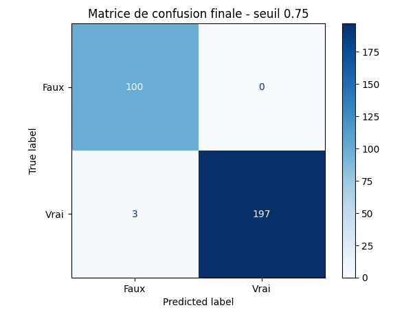
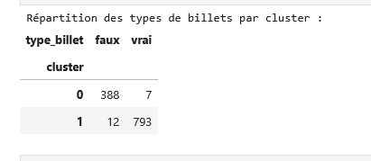

<a href="../README.md">← Retour au portfolio</a>

#  P12 — Détection de faux billets

  
  
  
  

---

  
   
  Comparaison des modèles de classification

##  Contexte

Projet de Machine Learning supervisé réalisé dans le parcours Data Analyst OpenClassrooms.

##  Besoin métier

Classifier automatiquement un billet comme authentique ou suspect à partir de mesures géométriques, en priorisant la détection des faux billets pour limiter les faux négatifs.

##  Données

Le jeu d'entraînement comprend 1 500 billets et six mesures : `length`, `height_left`, `height_right`, `margin_up`, `margin_low` et `diagonal`.

37 valeurs manquantes ont été relevées dans `margin_low` (2,47 % du jeu). Plusieurs stratégies ont été comparées : suppression, imputation médiane et `KNNImputer`.

##  Démarche

1. exploration et audit des valeurs manquantes ;
2. comparaison de stratégies de préparation ;
3. entraînement de régression logistique, KNN, Random Forest et K-means ;
4. validation croisée et optimisation des paramètres ;
5. lecture de la matrice de confusion centrée sur les faux négatifs ;
6. étude de différents seuils de décision ;
7. sauvegarde du pipeline et prédiction sur un fichier de production.

##  Évaluation

Les métriques sont lues prioritairement sur la classe « faux billet » : précision, rappel, F1 et F-beta, complétées par la matrice de confusion. La régression logistique optimisée (`C = 7`) est retenue comme modèle de référence.

Sur le jeu de test, le seuil standard de 0,50 laisse encore passer deux faux billets. Lors des essais, un seuil de 0,65 atteint un rappel de 100 % sur les faux billets, au prix de trois vrais billets classés comme suspects. Ce seuil doit être revalidé sur des données indépendantes avant un usage réel.

##  Compétences mobilisées

- classification ;
- préparation de données ;
- évaluation ;
- analyse d'erreurs ;
- communication des résultats.

##  Résultats

Le projet fournit un notebook d'analyse, un modèle sauvegardé avec son prétraitement et un script de prédiction robuste au séparateur du fichier CSV. La démarche trace les comparaisons réalisées plutôt que de s'appuyer uniquement sur l'accuracy globale.

##  Livrables

- [Notebook d'analyse](livrables/P12_analyse_detection_faux_billets.ipynb)
- [Modèle sauvegardé](livrables/best_billet_model_from_template.joblib)
- [Script de prédiction](livrables/predict_billets.py)
- [Présentation de synthèse (PDF)](livrables/P12_presentation_detection_faux_billets.pdf)

##  Aperçu de l'évaluation

Les 37 valeurs manquantes de `margin_low` sont prises en charge par une imputation KNN fondée sur les cinq voisins les plus proches.

  

Les modèles sont comparés selon l'accuracy, mais surtout selon les métriques associées aux faux billets.

La matrice de confusion sert à visualiser le compromis entre détection des faux billets et mise en alerte de vrais billets. Cette illustration correspond à un essai avec un seuil de décision de 0,75.

  

K-means fait partie des méthodes comparées ; sa répartition confirme son rôle de point de référence non supervisé face aux modèles de classification supervisée.

  

##  Limites

- représentativité ;
- généralisation ;
- erreurs de mesure ;
- stabilité sur de nouvelles données.
- le seuil de décision dépend du coût métier relatif des faux négatifs et faux positifs.

##  Prochaines pistes

- validation indépendante ;
- comparaison d'algorithmes ;
- importance des variables ;
- suivi des performances.
- calibration du seuil sur un jeu de validation indépendant.

---

[← Retour au portfolio](../README.md)
