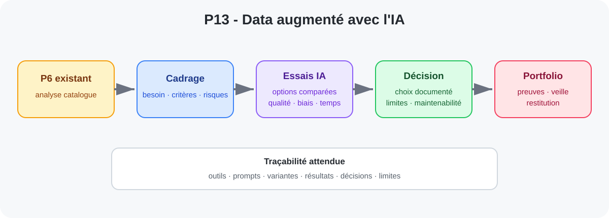

<a href="../README.md">← Retour au portfolio</a>

#  P13 — Piloter un projet Data augmenté avec l'IA et créer son portfolio

---

  
   
  Workflow du projet Data augmenté avec l’IA et du portfolio

## 📋 Contexte

Dernier projet du parcours **Data Analyst OpenClassrooms**.

Le projet reprend le livrable du P6 afin de l'améliorer avec l'aide de l'IA selon une démarche **critique, comparative et documentée**, puis construit le portfolio professionnel.

## 🎯 Objectifs

- veille métier et technologique ;
- identification du besoin ;
- cahier des charges fonctionnel ;
- organisation du projet ;
- expérimentation ;
- comparaison d'options ;
- documentation et traçabilité ;
- présentation de preuves de compétences.

## 📌 Partie 1 — Amélioration du P6

Les essais doivent conserver la trace :
- des outils ;
- des prompts ;
- des variantes ;
- des résultats ;
- des décisions.

## 🔎 Veille Data & IA

Une application de veille dédiée a été développée pour soutenir le projet : collecte RSS/Atom, journalisation, pré-classification locale par Qwen et traduction d'extraits RSS.

➡️ [Voir la fiche de l'application de veille](../veille_data_ia/)

Critères possibles :
- qualité ;
- biais ;
- temps ;
- reproductibilité ;
- sécurité ;
- conformité ;
- maintenabilité.

## 📌 Cadrage métier

Le cahier des charges doit préciser :
- contexte ;
- parties prenantes ;
- problématique ;
- périmètre ;
- contraintes ;
- critères de réussite ;
- livrables.

## 📌 Pilotage

- découpage en lots ;
- backlog ;
- estimations ;
- dépendances ;
- définition de Done ;
- jalons ;
- risques ;
- validations.

## 📌 Documentation

- hypothèses ;
- essais ;
- choix techniques ;
- limites ;
- biais ;
- environnement ;
- versions ;
- instructions d'exécution.

## 📌 Partie 2 — Portfolio

Le portfolio présente des projets OpenClassrooms et des projets personnels pertinents.

Chaque preuve suit la logique :

**contexte → besoin métier → données → démarche → résultats → impact / recommandations → limites → prochaines pistes**

## 📈 État actuel

Projet en cours.

La partie portfolio est engagée : le dépôt rassemble les fiches des projets OpenClassrooms et personnels, avec une distinction explicite entre réalisations abouties, expérimentations et R&D. Le P6 original est archivé séparément comme livrable historique.

La partie d'amélioration IA du P6 reste à réaliser et devra être documentée dans un espace distinct : cadrage, essais comparatifs, prompts ou outils utilisés, décisions, limites et bilan critique.

---

[← Retour au portfolio](../README.md)
