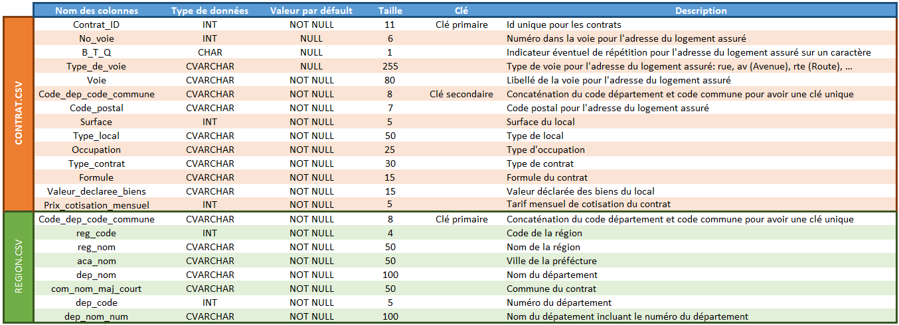

<a href="../README.md">← Retour au portfolio</a>

#  P3 — Modélisation et interrogation SQL

  

---

  
   
  Schéma relationnel du projet

## 📋 Contexte

Projet du parcours Data Analyst d'OpenClassrooms consacré à la construction et à l'exploitation d'une base de données relationnelle.

## 🎯 Objectif

Transformer un besoin de gestion en un modèle de données cohérent, puis produire des requêtes SQL répondant aux questions métier.

## ⚙️ Démarche

- étude des entités, attributs et relations ;
- formalisation du schéma de données et du dictionnaire associé ;
- création des tables SQL, notamment autour des données d'étudiants, de régions et de contrats ;
- rédaction et vérification des requêtes demandées.

## 🎓 Compétences mobilisées

SQL, modélisation relationnelle, clés primaires et étrangères, intégrité référentielle, dictionnaire de données.

## 📈 Aperçu du projet

Le schéma relationnel matérialise le lien entre les contrats et leur contexte géographique. Il constitue la base des requêtes d'analyse et des contrôles d'intégrité.

Le dictionnaire de données formalise les champs, leurs types et leur rôle dans le modèle.

  

Le chargement de la base est vérifié avant l'analyse, notamment par des requêtes de comptage.

  

Les requêtes SQL permettent ensuite de comparer les contrats par région et d'examiner les cotisations moyennes selon le département.

  

  

## 📦 Livrables réalisés

Le projet d'origine contient le schéma, les scripts SQL, un dictionnaire de données et une documentation technique. Les données brutes ne sont pas dupliquées dans ce portfolio.

- [Document technique](livrables/P3_document_technique.pdf)
- [Liste des requêtes](livrables/P3_liste_requetes.pdf)
- [Méthodologie de requête SQL](livrables/P3_methodologie_requetes_sql.pdf)

---

[← Retour au portfolio](../README.md)
