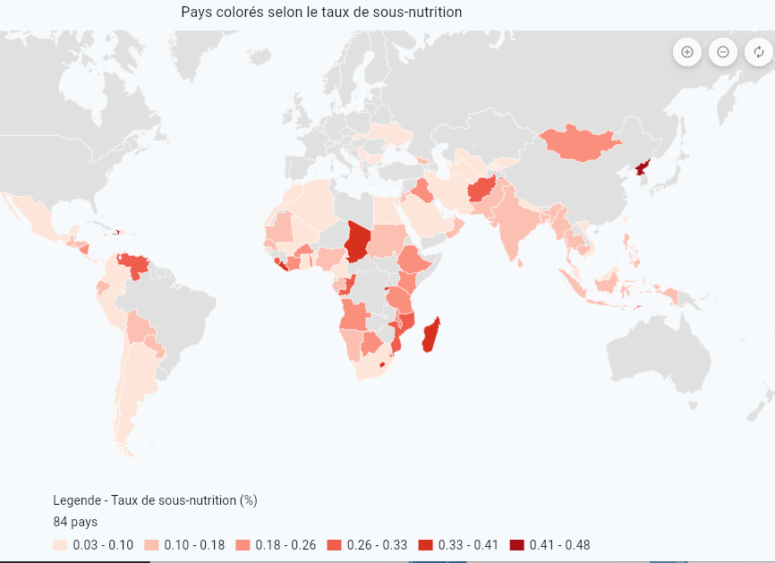
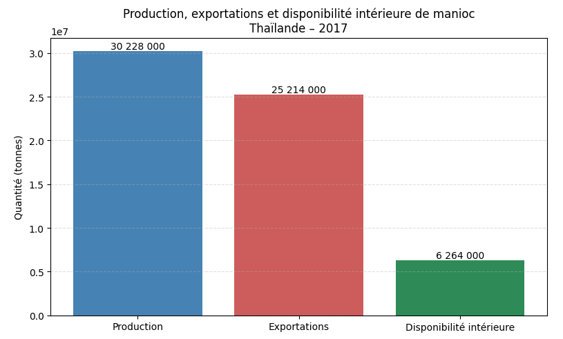
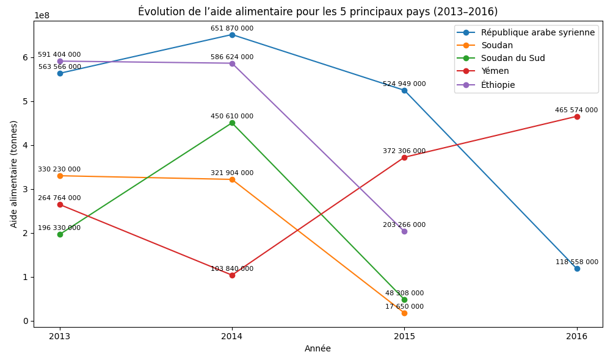
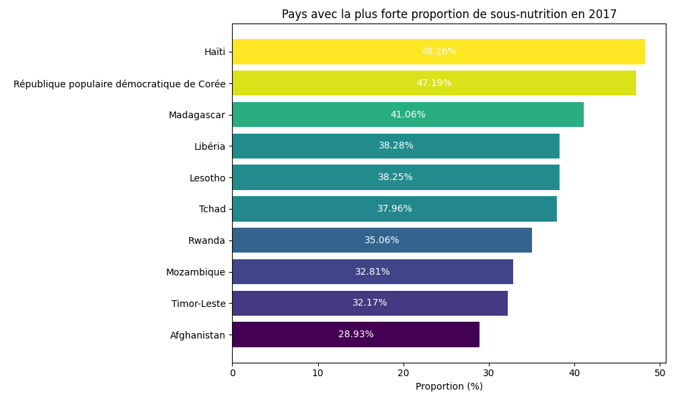
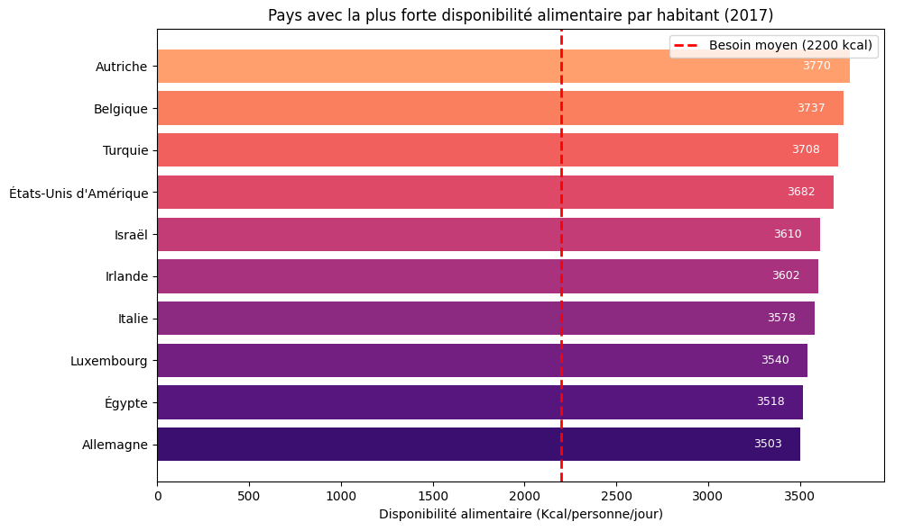
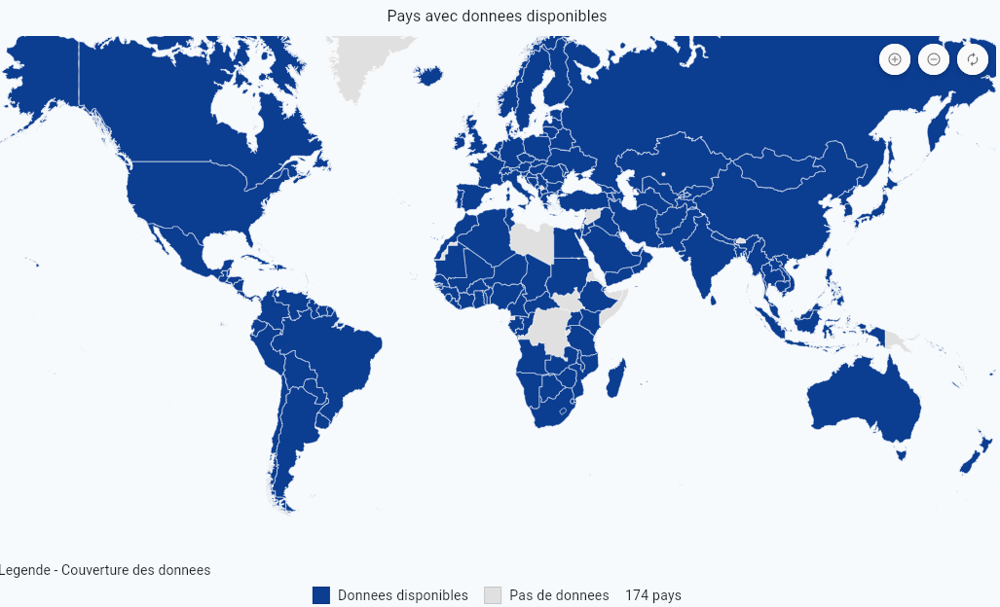

<a href="../README.md">← Retour au portfolio</a>

#  P4 — Étude de santé publique

  
  
  

---

  
   
  Répartition géographique du taux de sous-nutrition

##  Contexte

Analyse exploratoire de données publiques de la FAO dans le cadre du parcours Data Analyst d'OpenClassrooms.

##  Objectif

Mettre en relation des indicateurs de population, de disponibilité alimentaire, de sous-nutrition et d'aide alimentaire afin d'éclairer une problématique de santé publique.

##  Démarche

- chargement et harmonisation de quatre jeux de données CSV ;
- normalisation des clés géographiques et temporelles ;
- calcul d'indicateurs comparables entre pays et années ;
- production de graphiques sur l'évolution de la population mondiale, la sous-nutrition, l'aide alimentaire et la disponibilité alimentaire.

##  Compétences mobilisées

Python, Pandas, nettoyage de données, jointures, analyse exploratoire et visualisation.

##  Aperçu de l'analyse

Le bilan alimentaire met en regard la production, les exportations et la disponibilité intérieure à l'échelle mondiale.

  

L'analyse compare l'évolution de l'aide alimentaire reçue par plusieurs pays entre 2013 et 2016.

  

Les pays sont ensuite comparés selon leurs taux de sous-nutrition et leur disponibilité alimentaire par personne et par jour.

  

  

Les cartes mondiales donnent une lecture géographique de la couverture des données et de la sous-nutrition.

  

##  Point d'attention

Les résultats dépendent de définitions statistiques et de périmètres temporels propres aux sources FAO : ils doivent être interprétés dans ce cadre, sans conclure à une causalité directe.

##  Livrables

- [Notebook d'analyse](livrables/P4_etude_sante_publique.ipynb)
- [Notebook exporté en PDF](livrables/P4_notebook_analyse_sante_publique.pdf)
- [Présentation de synthèse (PDF)](livrables/P4_presentation_etude_sante_publique.pdf)

---

[← Retour au portfolio](../README.md)
