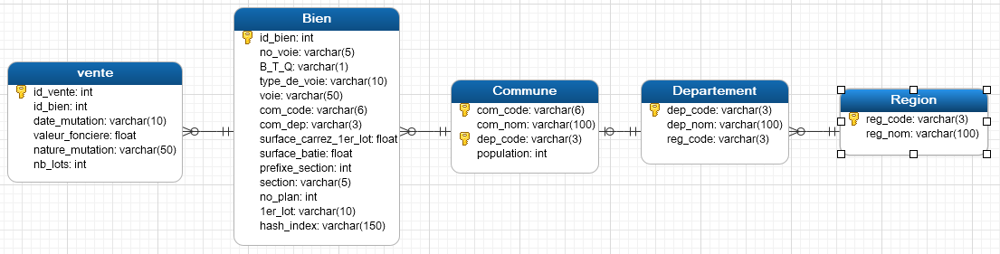
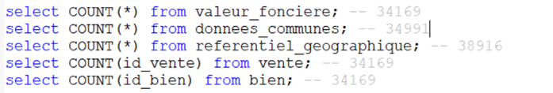
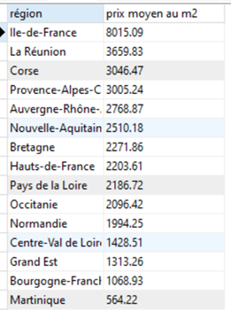
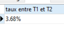
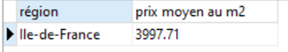

<a href="../README.md">← Retour au portfolio</a>

#  P5 — Exploitation de données immobilières avec SQL

  

---

## Contexte

Projet du parcours Data Analyst d'OpenClassrooms portant sur l'organisation et l'interrogation de données immobilières.

## Objectif

Structurer les informations liées aux biens et aux communes afin de faciliter leur consultation et leur analyse dans une base relationnelle.

## Démarche

- analyse de la structure des données immobilières ;
- création et alimentation des tables SQL ;
- utilisation de clés et de contraintes pour relier les biens à leur contexte géographique ;
- écriture de requêtes d'exploration et de contrôle.

## Compétences mobilisées

MySQL, SQL, modélisation relationnelle, contraintes, indexation et contrôle de cohérence.

## Aperçu du projet

Le modèle relationnel relie les ventes, les biens, les communes, les départements et les régions pour permettre l'analyse des transactions immobilières.

  

Le chargement des différentes sources est vérifié avant l'exécution des requêtes d'analyse.

  

Les requêtes répondent ensuite à des questions métier sur les prix et les volumes de ventes.

  

  

  

## Livrables réalisés

Les données brutes et les scripts sources ne sont pas recopiés ici afin de garder le portfolio léger.

- [Dictionnaire de données](livrables/P5_dictionnaire_de_donnees.xlsx)
- [Présentation de synthèse (PDF)](livrables/P5_presentation_donnees_immobilieres.pdf)

---

[← Retour au portfolio](../README.md)
