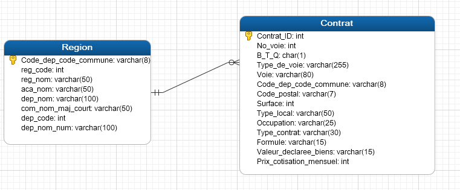
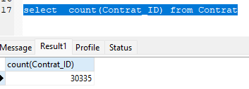
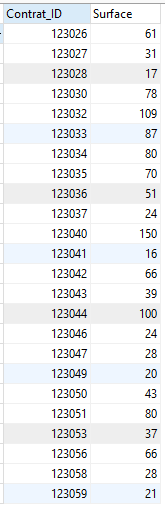
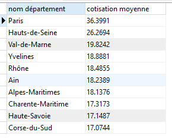

# P5 — Exploitation de données immobilières avec SQL

## Contexte

Projet du parcours Data Analyst d'OpenClassrooms portant sur l'organisation et l'interrogation de données immobilières.

## Objectif

Structurer les informations liées aux biens et aux communes afin de faciliter leur consultation et leur analyse dans une base relationnelle.

## Démarche

- analyse de la structure des données immobilières ;
- création et alimentation des tables SQL ;
- utilisation de clés et de contraintes pour relier les biens à leur contexte géographique ;
- écriture de requêtes d'exploration et de contrôle.

## Compétences mobilisées

MySQL, SQL, modélisation relationnelle, contraintes, indexation et contrôle de cohérence.

## Aperçu du projet

Le projet repose sur un modèle relationnel séparant les contrats immobiliers de leur contexte géographique. Cette structure permet d'écrire des requêtes fiables et d'éviter la duplication des informations.

Le dictionnaire de données formalise les champs, leurs types et leur rôle dans les différentes tables.

Le chargement des données est contrôlé avant les analyses, notamment par le comptage des enregistrements insérés.

Les requêtes répondent ensuite aux questions métier, par exemple sur la répartition des ventes par région et les comparaisons de cotisations moyennes.

## Livrables réalisés

Les données brutes et les scripts sources ne sont pas recopiés ici afin de garder le portfolio léger.

- [Dictionnaire de données](livrables/P5_dictionnaire_de_donnees.xlsx)
- [Présentation de synthèse (PDF)](livrables/P5_presentation_donnees_immobilieres.pdf)
