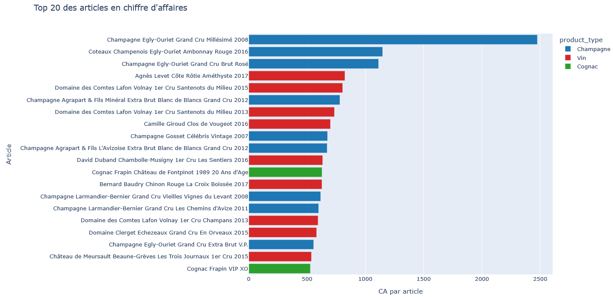
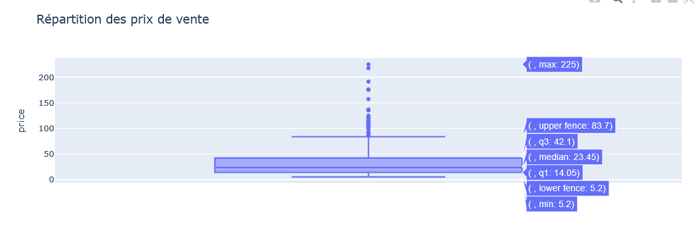
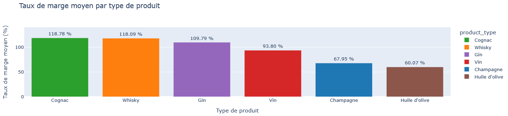
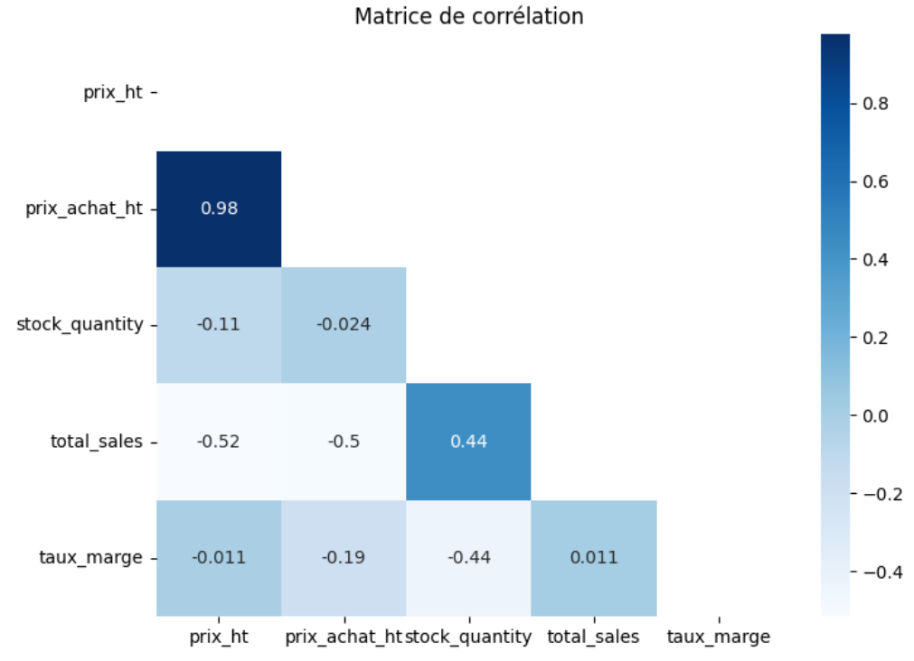
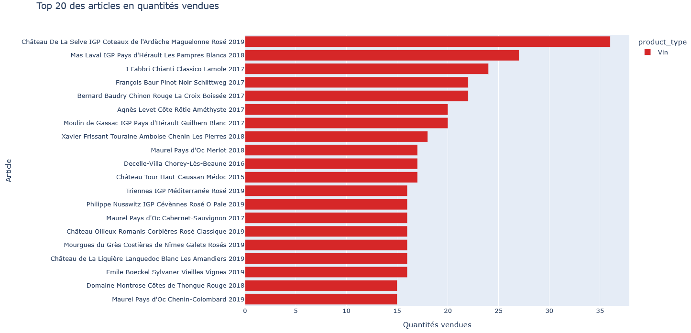
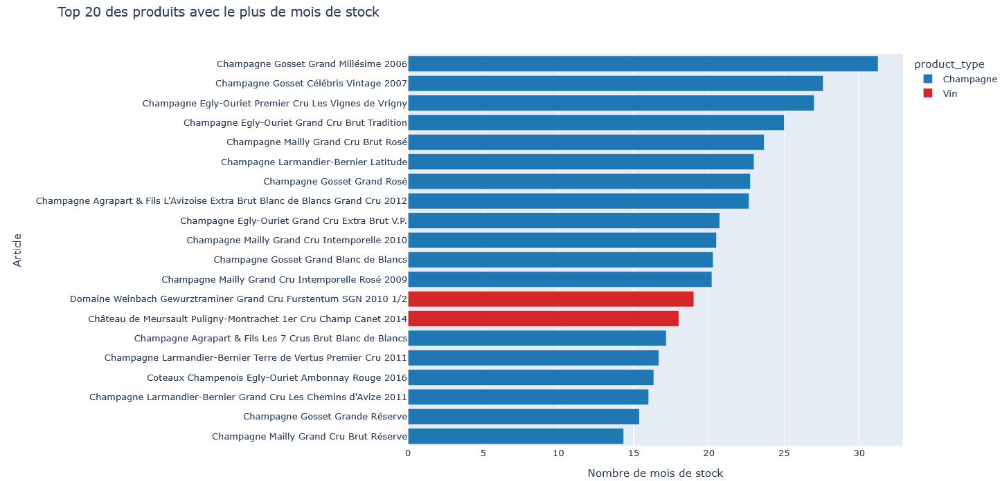

<a href="../README.md">← Retour au portfolio</a>

#  P6 — Analyse du catalogue d'un caviste

  
  
  
  

---

  
   
  Principales références par chiffre d’affaires

##  Contexte

Projet réalisé dans le cadre du parcours **Data Analyst OpenClassrooms**.

##  Besoin métier

Réconcilier le catalogue issu de l'ERP avec les produits publiés sur le site e-commerce, puis analyser les ventes, les prix et les stocks afin d'identifier des anomalies et des produits à surveiller.

##  Données

Trois sources Excel sont exploitées : le catalogue ERP, les produits du site e-commerce et une table de liaison entre leurs références.

- 825 références ERP ;
- 714 produits rapprochés avec les données web ;
- 111 références non rapprochées à investiguer ;
- variables principales : prix, quantité en stock, ventes cumulées et métadonnées de publication.

##  Démarche

1. compréhension du besoin ;
2. audit des données ;
3. nettoyage ;
4. analyse exploratoire ;
5. visualisation ;
6. interprétation ;
7. recommandations.

##  Résultats

Le notebook produit un jeu de données consolidé, contrôle les incohérences de prix et de stock, et présente les ventes cumulées par produit. L'analyse met notamment en évidence des valeurs négatives à vérifier dans les données de prix ou de stock, ainsi que les références sans correspondance entre ERP et site.

##  Aperçu de l'analyse

La distribution des prix met en évidence un catalogue majoritairement positionné sur des prix accessibles, complété par quelques références premium.

  

La marge moyenne varie fortement selon les familles de produits : ce résultat fournit un premier axe de priorisation commerciale.

  

La matrice permet de mettre en regard prix, coût d'achat, stock, ventes cumulées et taux de marge.

  

Les classements par chiffre d'affaires et par quantités vendues distinguent les références qui génèrent le plus de valeur de celles qui génèrent le plus de volume.

  

Enfin, la couverture de stock en mois identifie les références à surveiller pour éviter une immobilisation excessive.

  

##  Compétences mobilisées

- préparation des données ;
- EDA ;
- contrôle qualité ;
- visualisation ;
- interprétation métier ;
- documentation.

##  Limites

- les ventes sont disponibles sous forme cumulée, sans historique de transactions ;
- les dates de publication WordPress ne correspondent pas à des dates d'achat ;
- il n'est donc pas possible d'établir une prévision saisonnière fiable à partir de ce jeu de données seul.

##  Livrables

- [Notebook d'analyse](livrables/P6_analyse_catalogue_caviste.ipynb)
- [Présentation de synthèse (PDF)](livrables/P6_presentation_analyse_catalogue_caviste.pdf)

---

[← Retour au portfolio](../README.md)
