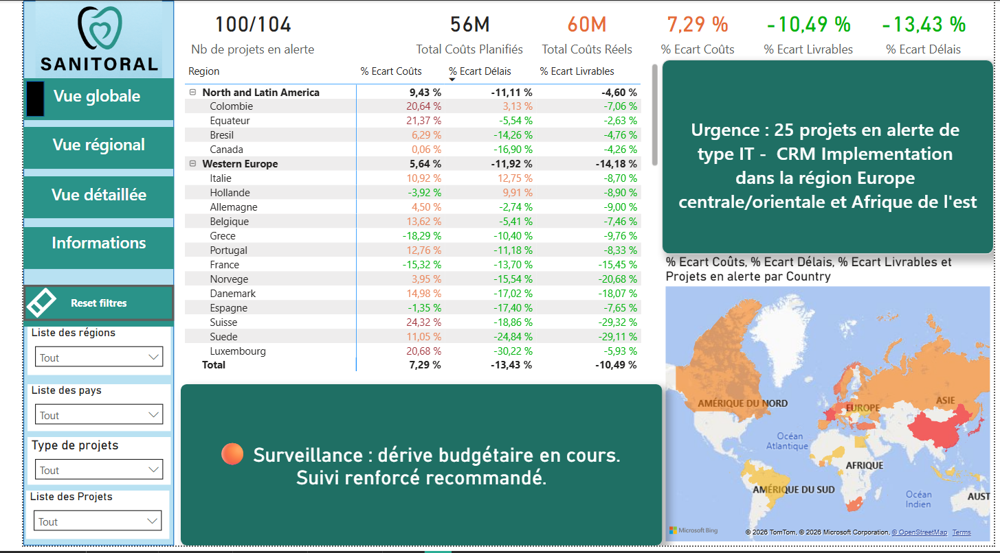
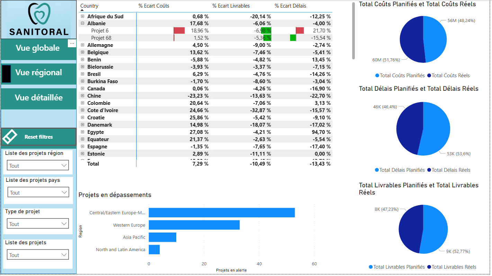
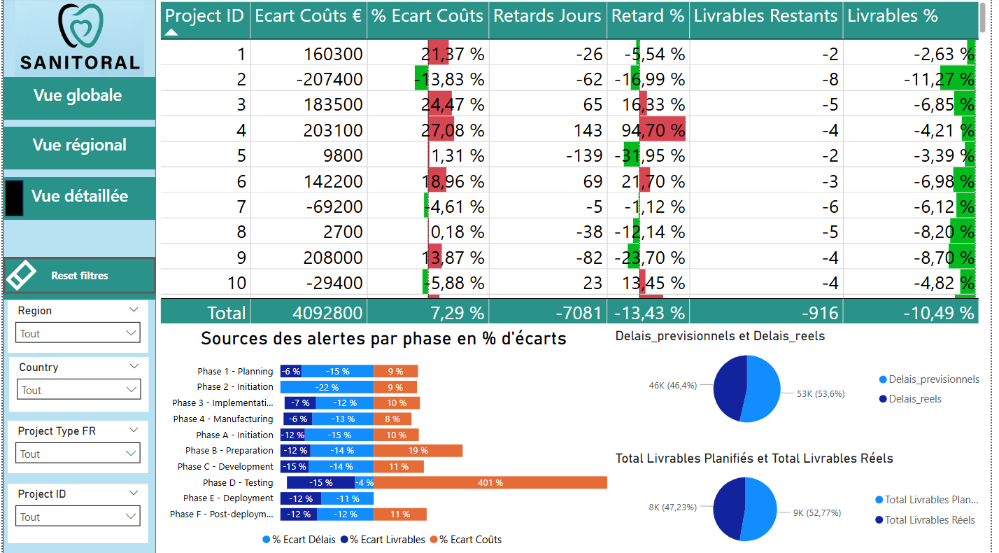
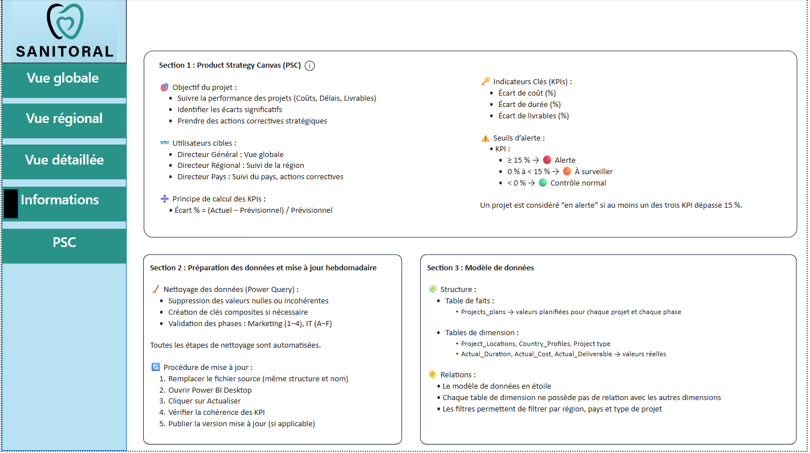
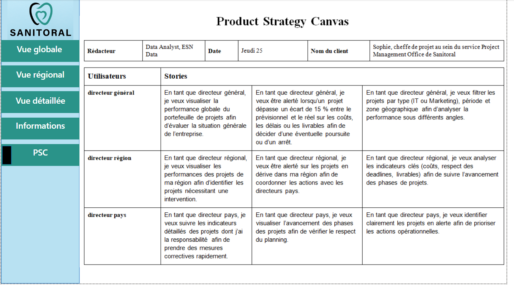

<a href="../README.md">← Retour au portfolio</a>

#  P7 — Tableau de bord de pilotage

  

---

  
   
  Vue globale du tableau de bord Sanitoral

## 📋 Contexte

Projet de Business Intelligence réalisé dans le parcours **Data Analyst OpenClassrooms**, autour de l'entreprise fictive Sanitoral.

## 🎯 Besoin métier

Mettre à disposition un tableau de bord interactif de suivi des projets IT et Marketing pour identifier les retards, dérives de coûts et écarts sur les livrables.

Les publics visés sont la direction générale, les directions régionales et les directions pays.

## 🗃️ Données

Données fictives de projets, de phases et d'indicateurs de performance : coûts, délais et livrables. Les données sont préparées dans Power Query avant modélisation dans Power BI.

## ⚙️ Démarche

1. compréhension du besoin ;
2. préparation ;
3. modélisation ;
4. KPI ;
5. mesures DAX ;
6. visualisations ;
7. validation du tableau de bord.

## 📈 Résultats

Le livrable est un tableau de bord Power BI interactif, filtrable par région, pays et type de projet. Il fournit une lecture globale des performances et aide à prioriser les projets présentant un écart significatif entre prévision et réalisé.

Le fichier Power BI est disponible dans [livrables/P7_tableau_bord_sanitoral.pbix](livrables/P7_tableau_bord_sanitoral.pbix).

### Aperçu du tableau de bord

**Vue globale** — synthèse des KPI, zones à surveiller et carte de répartition.

**Vue régionale** — comparaison des coûts, délais et livrables, avec accès au détail des projets en alerte.

  

**Vue détaillée** — suivi projet par projet et lecture des écarts par phase.

  

La page de documentation explicite les KPI, seuils d'alerte, processus de mise à jour et modèle de données. Le *Product Strategy Canvas* formalise les besoins des utilisateurs cibles.

  

  

## 🎓 Compétences mobilisées

- Business Intelligence ;
- modélisation ;
- DAX ;
- préparation de données ;
- datavisualisation ;
- restitution métier.

## ⚠️ Limites et prochaines pistes

Le cas est construit sur des données pédagogiques. En contexte réel, le modèle devrait être alimenté par des sources opérationnelles actualisées, avec des règles de qualité et de gouvernance documentées.

---

[← Retour au portfolio](../README.md)
