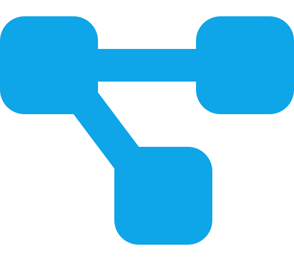
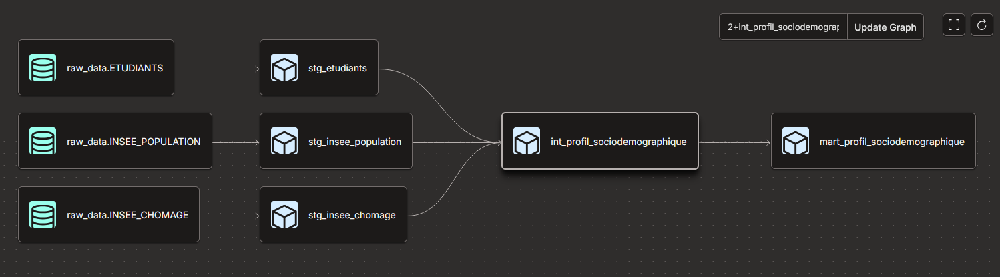
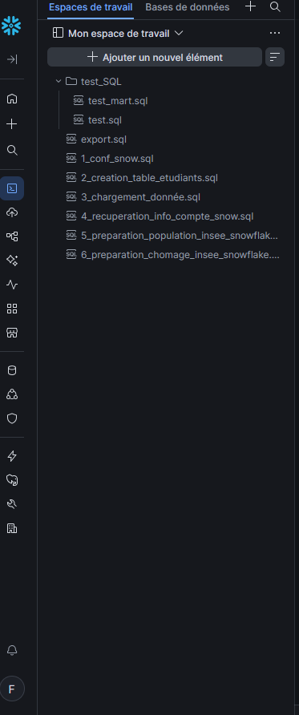
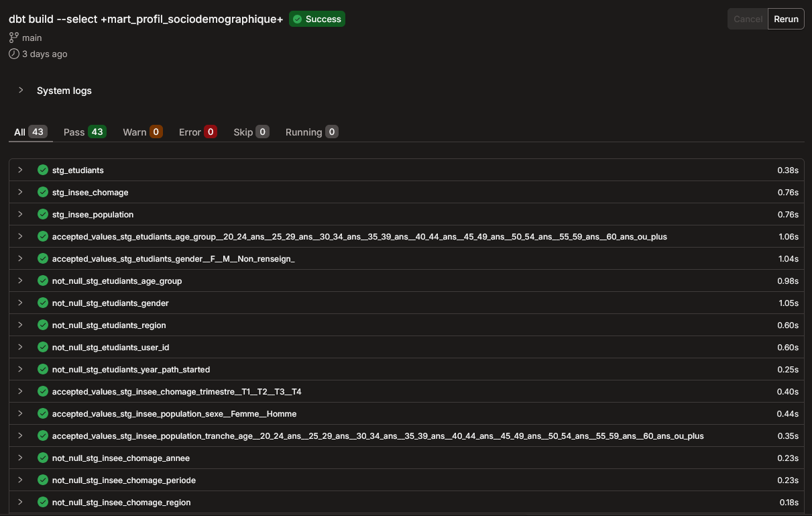
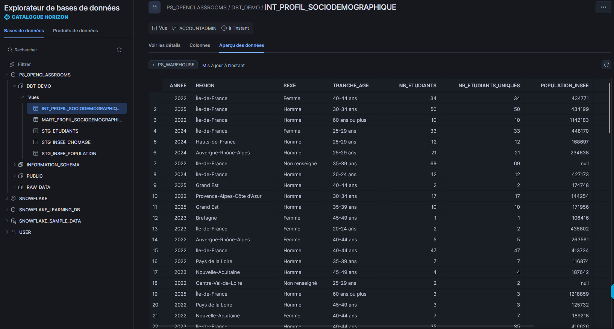

<a href="../README.md">← Retour au portfolio</a>

#  P8 — Pipeline de données sociodémographiques

  
  
  
  

---

  
   
  Lineage du pipeline dbt

## 📋 Contexte

Projet orienté **Data Engineering** réalisé dans le parcours Data Analyst OpenClassrooms. Il analyse l'évolution du profil sociodémographique des inscrits aux parcours Data entre 2022 et 2025.

## 🎯 Besoin métier

Construire une chaîne de transformation reproductible pour nettoyer, enrichir et rendre analysables les données d'inscription, avec une comparaison aux données de population INSEE.

## 🗃️ Données

Le jeu de départ comprend 4 646 inscrits, enrichis avec des données INSEE de population et de chômage régional. Les dimensions principales sont l'année, le genre, la tranche d'âge et la région.

Les valeurs de genre manquantes sont conservées dans une catégorie `Non renseigné`, afin de ne pas les faire disparaître de l'analyse. Les libellés de régions sont harmonisés avant jointure.

## ⚙️ Démarche

1. chargement des tables brutes dans Snowflake ;
2. standardisation dans les modèles `staging` ;
3. enrichissement et agrégations intermédiaires ;
4. construction du mart `mart_profil_sociodemographique` ;
5. contrôles dbt et SQL sur les valeurs, bornes et collisions d'identifiants ;
6. génération de documentation et export de la table finale.

## 🎓 Compétences mobilisées

- Data Engineering ;
- SQL ;
- dbt ;
- Snowflake ;
- qualité des données ;
- reproductibilité.

## 📈 Résultats

Le pipeline produit une table analytique consolidée et un export CSV. Elle permet d'étudier les effectifs, les utilisateurs uniques, les répartitions par âge, genre et région, ainsi que les écarts de représentation entre les inscrits OpenClassrooms et la population de référence INSEE.

## 📈 Aperçu du pipeline

Les scripts SQL sont organisés dans Snowflake, puis dbt construit la chaîne de modèles à partir des données brutes, des couches de préparation et du mart final.

  

Le contrôle `dbt build` exécute les modèles et tests associés. La capture ci-dessous montre une exécution réussie de 43 vérifications.

  

Le mart final consolide les indicateurs sociodémographiques par année, région, genre et tranche d'âge.

  

## ⚠️ Limites

Le projet repose sur des données pédagogiques et une analyse descriptive : les écarts observés ne permettent pas d'établir de lien causal. Les données brutes ne sont pas publiées dans le portfolio.

## 🚀 Prochaines pistes

- automatisation de l'actualisation ;
- monitoring de fraîcheur et de qualité ;
- tests supplémentaires sur les jointures et les évolutions de structure ;
- visualisation des indicateurs à partir du mart final.

## 🔗 Source

- [Dépôt dbt du projet P8](https://github.com/Fighter777/projet_P8)

---

[← Retour au portfolio](../README.md)
