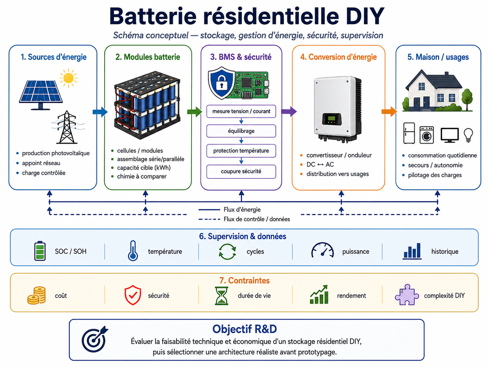

<a href="../README.md">← Retour au portfolio</a>

#  Étude de faisabilité — Batterie résidentielle DIY

---

## Contexte

Étude personnelle portant sur la faisabilité technique et économique d'un stockage électrique résidentiel construit à partir de cellules ou de chimies adaptées à un usage stationnaire.

La réflexion a notamment porté sur les technologies **zinc-ion** en développement, ainsi que sur les alternatives plus accessibles pour une réalisation DIY.

Le projet est actuellement une **étude de faisabilité**, pas une batterie réalisée.

## Besoin / objectif

Déterminer :
- quelle capacité de stockage est pertinente pour un usage résidentiel ;
- quelles chimies sont réalistes en DIY ;
- quels compromis existent entre coût, durée de vie, sécurité et densité énergétique ;
- si une fabrication ou un assemblage personnel peut rester compétitif face aux batteries commerciales.

## Axes d'étude

### Dimensionnement
- consommation journalière ;
- puissance instantanée ;
- profondeur de décharge ;
- autonomie visée ;
- intégration avec une production photovoltaïque éventuelle.

### Technologies
Comparaison possible selon :
- énergie spécifique ;
- puissance ;
- cyclabilité ;
- coût par kWh ;
- disponibilité des matériaux ;
- complexité de fabrication ;
- besoin de gestion électronique.

### Zinc-ion
La technologie zinc-ion a été étudiée pour son intérêt potentiel en stockage stationnaire et pour les travaux de recherche annonçant des durées de cyclage élevées.

L'objectif n'est pas de reproduire directement un résultat de laboratoire, mais d'identifier ce qui est transposable à une fabrication expérimentale.

## Démarche R&D

1. définir le besoin énergétique ;
2. comparer plusieurs chimies ;
3. identifier les contraintes de fabrication ;
4. estimer le coût par kWh ;
5. étudier la durée de vie ;
6. évaluer la complexité du BMS / équilibrage ;
7. déterminer si une cellule expérimentale est pertinente ;
8. comparer avec une solution commerciale.

  

## Données à constituer

Pour chaque technologie :
- tension nominale ;
- capacité ;
- densité énergétique ;
- cyclabilité ;
- rendement ;
- coût matière ;
- coût système ;
- température de fonctionnement ;
- contraintes de sécurité.

## Compétences mobilisées

- veille scientifique et technique ;
- analyse multicritère ;
- dimensionnement énergétique ;
- électrochimie appliquée ;
- estimation économique ;
- expérimentation ;
- analyse de faisabilité.

## État actuel

Phase d'étude et de comparaison.

Aucune batterie résidentielle complète n'a encore été réalisée ni validée.

## Limites

- performances publiées en laboratoire non directement transposables ;
- disponibilité variable des matériaux ;
- forte influence du procédé de fabrication ;
- absence de validation cyclique sur cellule personnelle ;
- nécessité de comparer le coût système complet, pas uniquement celui des matériaux.

## Prochaines étapes

- définir une capacité résidentielle cible ;
- établir une matrice comparative de chimies ;
- sélectionner une technologie réaliste ;
- chiffrer un prototype ;
- éventuellement réaliser une cellule expérimentale à petite échelle avant tout passage à une capacité supérieure.

---

[← Retour au portfolio](../README.md)
