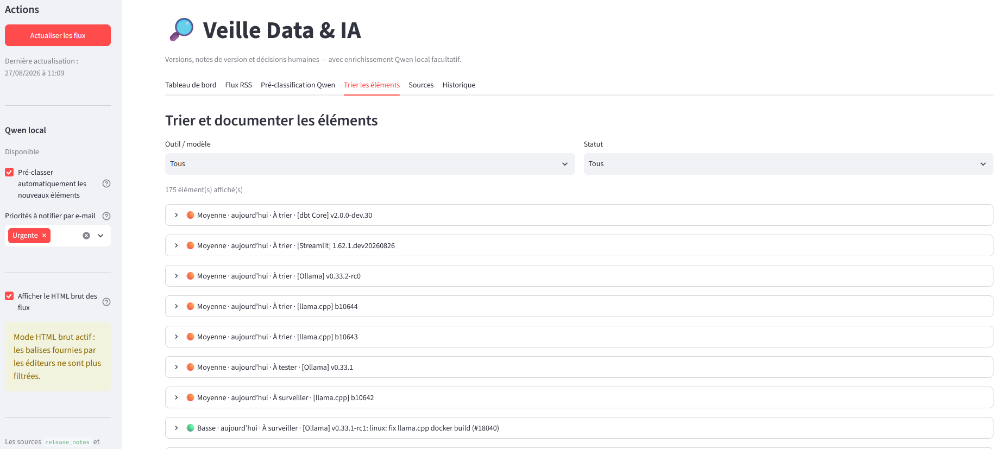

<a href="../README.md">← Retour au portfolio</a>

#  Veille Data & IA

  
  
  

---

  
   
  Tableau de bord : suivi des éléments archivés et répartition des priorités

## 📋 Contexte

Application Streamlit développée dans le cadre du P13 OpenClassrooms afin de centraliser une veille Data et IA : versions d'outils, notes de version et évolutions de modèles.

➡️ [Voir le code source](https://github.com/Fighter777/veille-data-ia-app)

## 🎯 Objectif

Transformer un flux de veille hétérogène en liste de travail exploitable : conserver les sources et leur historique, repérer les nouveautés utiles, puis accélérer leur classement initial sans remplacer la lecture humaine.

## ✨ Fonctionnalités

- collecte de flux RSS et Atom configurables ;
- archivage des sources, articles et journaux d'actualisation dans SQLite ;
- affichage sécurisé du HTML des flux, avec mode brut facultatif ;
- pré-classification locale par Qwen : statut, priorité, projets concernés et résumé ;
- traduction à la demande des extraits RSS ;
- tri visuel par priorité, statut et ancienneté ;
- réglages persistants : pré-classification automatique et niveaux d'alerte e-mail.

## 🧩 Architecture

**Flux RSS / Atom → Streamlit → SQLite**

Branches d'enrichissement :

**Streamlit → Qwen local → pré-classification / traduction**

**Streamlit → SMTP local → alertes configurables**

L'application est prévue pour être déployée derrière Nginx sur un serveur dédié. Le modèle Qwen reste sur une machine distincte, accessible uniquement via le réseau privé.

## ⚙️ Démarche

1. Les flux collectés sont archivés avec leur source et leur date.
2. Qwen classe les nouvelles entrées selon une priorité et un statut de travail.
3. La liste est parcourue selon l'ancienneté, le niveau de priorité et le besoin de lecture ou de test.
4. La décision finale reste documentée et modifiable par l'utilisateur.

## 🎓 Compétences mobilisées

- automatisation de veille ;
- intégration d'un LLM local ;
- conception d'une interface Streamlit ;
- persistance SQLite ;
- ingestion RSS / Atom ;
- pré-classification et validation humaine ;
- pratiques de déploiement et séparation des secrets.

## ⚠️ Limites

- l'application affiche uniquement le contenu fourni par les flux, pas les articles externes complets ;
- les propositions de Qwen servent de premier tri et demandent une vérification humaine ;
- les sources sans flux RSS restent référencées, mais ne sont pas encore collectées automatiquement.

## 🚀 Prochaines pistes

- planifier la collecte sur le serveur dédié ;
- activer les alertes SMTP selon les priorités configurées ;
- proposer des notifications Web Push hors ligne, en alternative aux alertes e-mail ;
- intégrer progressivement des collecteurs fiables pour les sources sans flux RSS.

---

[← Retour au portfolio](../README.md)
