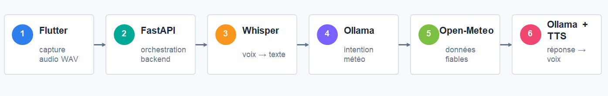
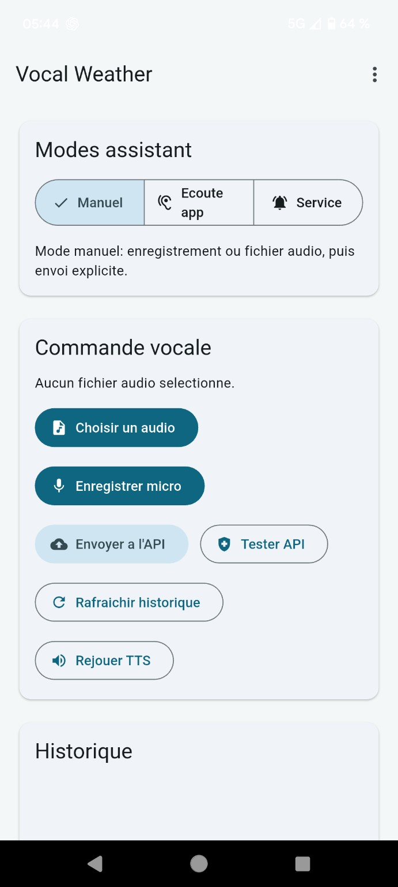

<a href="../README.md">← Retour au portfolio</a>

#  Vocal Weather — Assistant météo vocal

  
  
  
  
  

---

## Contexte

Application Flutter et FastAPI combinant reconnaissance vocale, interprétation en langage naturel, données météo et synthèse vocale. Le projet s'inscrit dans le cadre de la formation Développeur IA du GRETA, fondée sur le référentiel Simplon.

## Besoin / objectif

Permettre à un utilisateur de formuler une demande météo oralement et d'obtenir une réponse vocale construite à partir de données météorologiques réelles.

## Architecture

**voix → transcription → extraction du lieu et de l'horizon → Open-Meteo → réponse → synthèse vocale**

  

## Données

Les données météorologiques et le géocodage sont récupérés via Open-Meteo. Les entrées vocales sont transcrites localement avant interprétation. L'historique des demandes et les journaux techniques sont conservés dans SQLite.

## Démarche

Le projet sépare l'interface Flutter, l'API FastAPI et les services de transcription, NLU, météo et synthèse vocale. Le NLU peut fonctionner en mode règles, Ollama local ou hybride. L'application mobile intègre également une reconnaissance continue embarquée avec Vosk pour la détection de commandes.

## Compétences mobilisées

- intégration d'API ;
- développement mobile ;
- backend ;
- Speech-to-Text ;
- LLM local ;
- Text-to-Speech ;
- orchestration de services.

## Résultats

Le prototype réalise une demande météo vocale de bout en bout. Chaque requête possède un identifiant, est historisée, et les étapes du pipeline sont journalisées avec leur durée : transcription, interprétation, géocodage, récupération météo et synthèse vocale.

Les journaux permettent d'observer les latences réelles sans présenter une mesure unique comme universelle.

Le parcours a été testé en conditions réelles, notamment avec un essai volontairement ambigu sur un nom de ville, inspiré d'un cas ayant posé problème dans un autre projet de formation. Ce test a permis de vérifier le comportement de la chaîne de transcription et d'interprétation sur une formulation moins évidente.

  

## Limites

- qualité de transcription dépendante de l'environnement sonore ;
- interprétation dépendante du modèle utilisé ;
- latence cumulée ;
- qualité variable de la synthèse vocale.

## Prochaines pistes

- comparer plusieurs modèles ;
- améliorer la gestion des ambiguïtés ;
- constituer un jeu de requêtes de test et documenter les erreurs récurrentes.

---

[← Retour au portfolio](../README.md)
